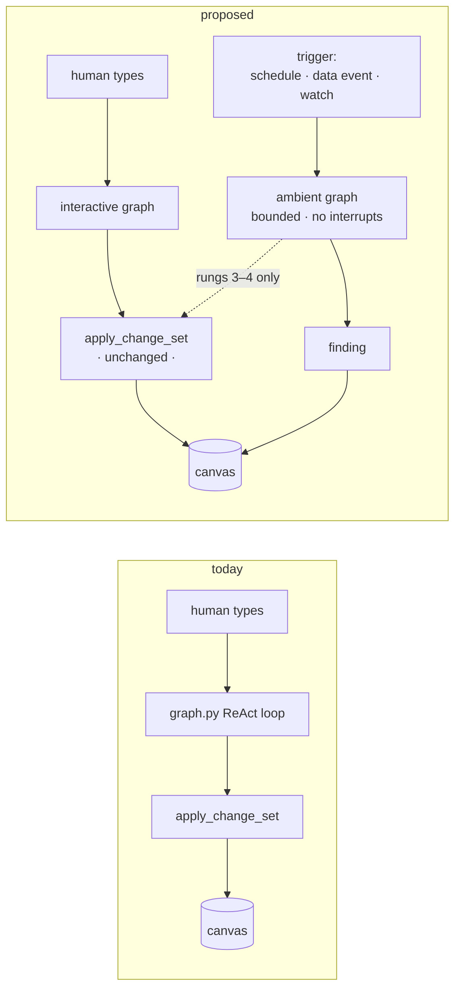
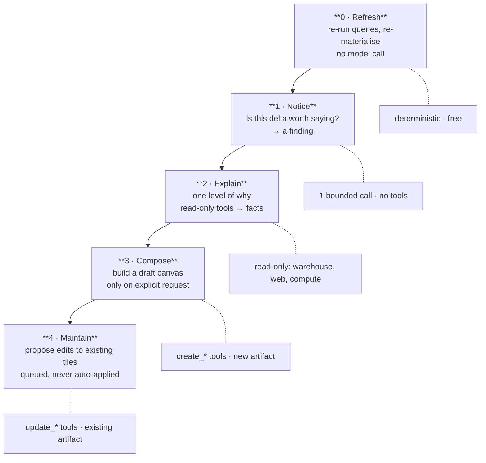
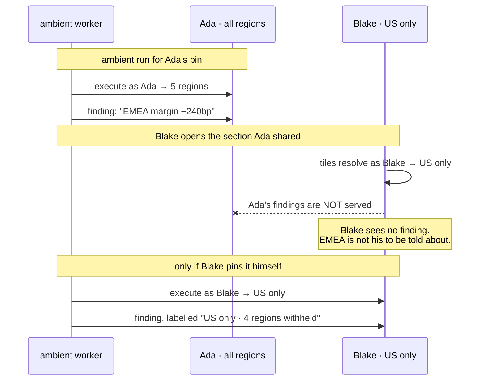
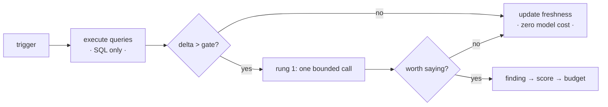
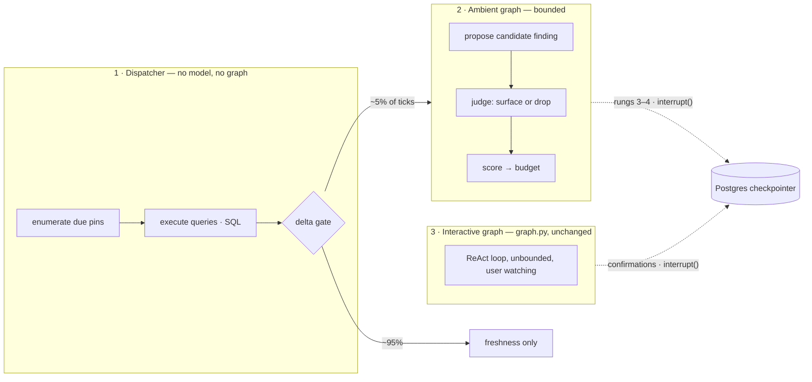
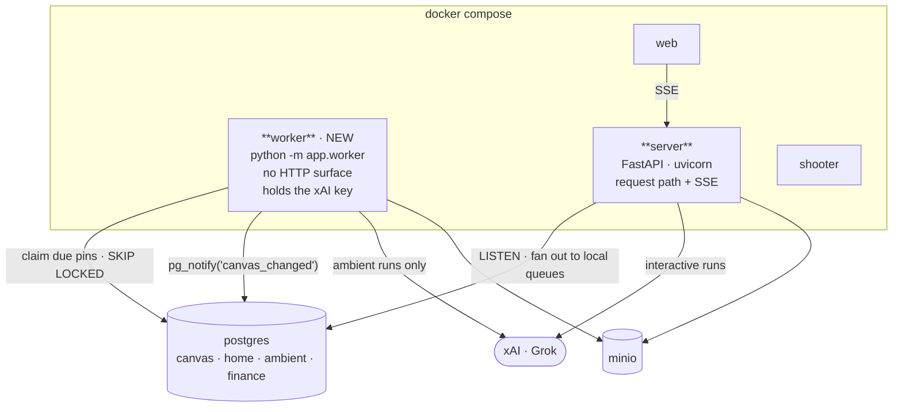

# Ambient agent — design proposal

Status: **proposal, not built.** Companion to `home-screen-design.md`.

Taking the composer off Home creates an obligation. A Home you cannot type into has
to justify itself by telling you something you did not ask for — otherwise it is a
bookmarks folder with a greeting. This document is how the agent earns that.

The bet: **the agent's value is highest exactly when the user is not there.** A user
at the keyboard can ask. A user away needs the system to have noticed on their behalf,
and to have been disciplined about what was worth saying.

---

## 1. What actually changes

Today the agent is strictly invoked. `graph.py` is a two-node ReAct loop; a run starts
because a human typed into the dock composer and ends when the model stops calling
tools. There is no path by which the agent does anything without a prompt.

Ambient adds one thing, and it is smaller than it sounds: **a second caller.**



The command boundary does not move. The ambient graph proposes typed change sets
through the same `apply_change_set` path, with the same validation, the same
`measured` invariant, the same audit rows and the same undo. **Ambient gets no new
write path** — if it did, every guarantee in `canvas-technical-architecture.md` §2
would need re-proving for a code path nobody is watching.

What ambient does get is a different *shape* of run: no user turn, no interrupts, no
disambiguation, a hard token budget applied at prompt assembly, and a terminal state
that is a typed object rather than prose.

---

## 2. The ladder

Five rungs of escalating blast radius. Each is separately gateable per user and per
org, and each is genuinely useful shipped alone. I would ship 0–2 and stop until the
findings are good, because rungs 3–4 are worthless on top of a noisy rung 1.



| Rung | Power | The thing it must not do |
|---|---|---|
| 0 Refresh | re-execute a stored recipe | invent a number the source did not return |
| 1 Notice | say one sentence | say it every morning (§5) |
| 2 Explain | read | write |
| 3 Compose | create a new, unshared artifact | touch anything the user already trusts |
| 4 Maintain | propose an edit | apply it |

Rung 0 is `home-screen-design.md` §4 and involves no model. It matters here because it
is the *filter*: the deterministic delta it computes is what decides whether rung 1
runs at all (§7).

Rung 3 **never fires speculatively** (D-7). A finding carries a `build this` action and
composing happens when the user takes it. A composed canvas is the most expensive thing
ambient can produce and the easiest to ignore, and PROBE's 40% (§8.4) says autonomous
resolution is not ready to be trusted unattended.

That does bring back a suggestion chip — but an earned one. The chip on the reference
screenshot offers a prompt you could have typed; this one is attached to a figure that
actually moved, and the agent already knows which. The difference between "here is
something you could ask" and "here is something that happened, want it built?" is the
whole argument for taking the composer off Home.

---

## 3. Triggers

Three, in increasing order of how much I like them.

| Trigger | Fires on | Notes |
|---|---|---|
| **Schedule** | the cadences in `home-screen-design.md` §4 | clock and fiscal. Cheap to reason about, wrong most of the time — it fires when nothing happened. |
| **Data event** | load watermark advances, a filing lands | fires because the *data* changed. Strictly better than clock: cheaper and never late. |
| **Watch condition** | a bound figure crosses a user-set band | the only trigger the user authored, so the only one with a guaranteed customer for its output. |

The watch condition is the new pin-modal field. Cadence and watch are separate
settings on purpose — *when to look* and *when to speak* are different decisions, and
collapsing them into one number is why most alerting is simultaneously noisy and late.
A tile can poll hourly and speak once a quarter.

**Ambient runs against your own pins, never against a section someone shared with
you.** Viewing a shared section creates no ambient work. If you want the agent
watching a tile Ada shared, pin it yourself — a pin is a reference, so this is cheap.
Without this rule, one popular shared section spawns ambient runs for every viewer,
and each of those runs executes entitled queries under a different identity for
figures that person never asked to be told about.

---

## 4. The finding

The output of rung 1. A typed object, not a message.

```sql
CREATE TABLE home.findings (
  id UUID PRIMARY KEY DEFAULT gen_random_uuid(),
  owner_subject TEXT NOT NULL,
  -- SET NULL, not CASCADE (D-9): a finding about a tile the user deleted *because of
  -- the finding* is the one most worth keeping. It leaves the brief and the Inbox and
  -- stays readable in Activity.
  pin_id UUID REFERENCES home.pins(id) ON DELETE SET NULL,
  pin_title TEXT,                -- denormalised so a detached finding still reads
  run_id UUID NOT NULL REFERENCES ambient.runs(id),
  kind TEXT NOT NULL,            -- moved | crossed | broke | stale | absent
  interaction TEXT NOT NULL,     -- notify | question | review  (§8.5)
  allowed JSONB,                 -- accept | edit | respond | ignore, per Agent Inbox
  headline TEXT NOT NULL,        -- one sentence
  bindings JSONB NOT NULL,       -- path → factId, same shape as canvas.widgets
  access_class TEXT NOT NULL,    -- inherited from the producing queries
  narrowed JSONB,                -- {"region": 4} when computed from partial data
  score NUMERIC NOT NULL,
  surfaced_at TIMESTAMPTZ,
  dismissed_at TIMESTAMPTZ,
  acted_at TIMESTAMPTZ,
  suppressed_until TIMESTAMPTZ,
  created_at TIMESTAMPTZ NOT NULL DEFAULT now()
);
```

**A finding binds to facts exactly as a widget does**, and goes through the same
`bind_and_materialize` check. That is the single most important property here: an
ambient finding *cannot be a vibe.* It has to name the figure that moved and carry the
provenance chain back to the query run that produced it. The machinery already exists
and already refuses unbound numbers on anything claiming `measured` — ambient inherits
that for free, and should not be allowed to opt out of it.

The `kind` taxonomy is deliberately small, and two of the five are absences:

- `moved` — a figure changed materially
- `crossed` — a watch band was breached
- `broke` — a query failed, a schema changed, an entitlement was revoked
- `stale` — the source did not update when it should have
- `absent` — expected data never arrived

`stale` and `absent` are the ones I would not cut. *Nothing happened when something
should have* is usually more urgent than any delta — month-close data that did not land
is a fire, and it is the failure mode a human staring at a dashboard is worst at
catching, because there is nothing on screen to catch.

---

## 5. The interrupt budget

This is the actual hard problem. Everything else here is plumbing.

An ambient agent's failure mode is not being wrong. It is being *noisy* — fourteen
findings every morning, the user stops reading, and the one that mattered is lost
inside the fourteen. Noise does not degrade the feature gracefully; it kills it, and
it kills it silently, because a user who has stopped reading Home looks identical in
the metrics to a user whose business is quiet.

So the budget is a hard constraint, not a setting:

1. **Three per user per day in the brief, and not user-configurable** (D-5). Findings
   *compete* — the agent must rank, and the budget forces a real choice rather than a
   list. It is an ops setting, not a preference, because everyone sets a preference to
   ten and then stops reading. The per-finding threshold already adapts through
   dismissal (point 4); a second adaptive mechanism on top of it would make tomorrow's
   brief unpredictable, which §5 argues is what makes a brief feel arbitrary.
2. **Budget the interrupt, not the record.** Findings below the line are not deleted;
   they attach to the tile they are about, which carries a changed-since-you-looked
   marker. Nothing is lost and the brief stays bounded — and critically they do *not*
   fall through into the Inbox, which would fill a queue with items needing no answer.
   See `home-screen-design.md` §1.2.
3. **Repeat suppression.** The same finding about the same pin does not resurface until
   the figure materially moves again, or `suppressed_until` passes. Without this,
   "EMEA margin is down" arrives every single morning forever and trains the user to
   ignore the brief — which is the exact outcome the budget exists to prevent.
4. **Dismissal is training signal.** Dismissing raises the score threshold for that
   pin-and-kind pair; opening it lowers it. A stated rule with a visible effect, not a
   learned model — the user should be able to predict what happens when they dismiss
   something, and a model they cannot inspect makes the brief feel arbitrary.
5. **Silence is a valid and common output.** Most mornings nothing happened. An empty
   brief that says so is correct. A system obliged to produce something will invent
   significance, and it will do it most enthusiastically on the quiet days when there
   is least to work with.

---

## 6. Entitlement: findings are personal

A tile in a shared section resolves per viewer (`home-screen-design.md` §6). A
*finding about* that tile was computed from one specific person's data, under their
entitlements. So findings do not travel.



The rules:

1. A finding **inherits `access_class`** from the queries that produced it, by the same
   `max()` rule as `derived` queries. A sentence computed from warehouse data is
   warehouse-class, however innocuous the sentence looks.
2. A finding **belongs to the pin owner** and is never served to anyone else — not to a
   section grantee, not in an export, not in the canvas summary handed to the model on
   a later turn.
3. A finding computed from **narrowed** data says so. Blake's revenue finding is a US
   finding and must be labelled one. A confident sentence about "revenue" that silently
   means "the 20% of revenue you can see" is the §6 hazard again, and prose is a much
   easier place to lose the qualifier than a chart is.

Point 2 is the one that will feel over-strict in review, and I would hold it anyway.
The alternative — re-deriving findings per viewer at read time — means an ambient model
call on the open of a shared section, which is both a cost surprise and a way to make
one person's curiosity spend another person's budget.

---

## 7. Cost: the delta gate

Ambient runs are the only thing in this system that spends money while nobody is
watching. That deserves a structural answer rather than a quota.

**The model is not invoked unless something moved.** Rung 0 is deterministic SQL. It
computes the delta, and only a delta clearing a numeric gate escalates to rung 1.



The gate defaults to a multiple of **the figure's own historical volatility**, not a
magic constant. A metric that swings 8% a week has to move more than one that never
does. This means the gate is derived from the data rather than guessed by whoever
filled in the form, and a noisy tile does not become an expensive tile.

The consequence worth stating plainly: **cost scales with change, not with time.** A
quiet week costs the price of some SQL. Adding a hundred pins to a stable business
adds approximately nothing. That is the property that makes ambient affordable enough
to leave on by default, and it is a property of the architecture rather than of a
budget cap — though the per-user daily token cap from
`canvas-technical-architecture.md` §11.2 still applies underneath, enforced before the
call rather than discovered after it.

---

## 8. Runtime: is this a separate graph?

**Yes — but the load-bearing decision is that most of ambient is not a graph at all.**

Three components, and the boundary between the first two is the one that matters:



### 8.1 Why not one graph with a mode flag

`graph.py` today is a two-node ReAct loop whose state is
`messages: Annotated[list[AnyMessage], add_messages]` and whose exit condition is
*"the model stopped calling tools."* That is the right shape for a person watching a
stream. It is the wrong shape for an unattended process, and the mismatch is not
cosmetic:

| | Interactive | Ambient |
|---|---|---|
| State | accumulating `messages` | one pin, one delta, one budget |
| Terminates when | the model stops calling tools | a typed object is produced, or a step cap trips |
| Step budget | effectively unbounded — a human can interrupt | hard cap, enforced before the call |
| Tools | the full registry | narrowed per rung, **absent** rather than discouraged |
| Failure | surfaces to the user | silent to the user, loud in ops |
| Cost ceiling | bounded by the user's patience | bounded by nothing, unless we bound it |

The last row is the argument. Bolting a mode flag onto a loop whose exit condition is
"the model stopped calling tools" hands an unattended process an unbounded budget and
a full tool registry. Narrowing by prompt is not narrowing; the ambient graph binds
fewer tools into `chat_model(tools)`, so a write tool is not reachable rather than
discouraged.

### 8.2 Why the dispatcher is not a graph either

This is the part the prior art is most emphatic about, and it is the easiest thing to
get wrong — if rung 0 is a graph node, someone will eventually put a model call in it.

**ProAct** ([arXiv 2605.25971](https://arxiv.org/html/2605.25971)) ablates exactly
this. Undirected idle-time compute — letting the agent think in the background without
a gate — spent **69.8k tokens per scenario for a 0.9% improvement.** The same budget
spent behind a prediction-and-value gate returned **14.1%**. Their gate is a composite
value function `S(z) = wr·rz + wg·gz + wv·vz + wτ·τz` over relevance, knowledge gap,
incremental value and timeliness, with a threshold below which no search is issued.
That is a 15× difference in return from adding a gate, and it is the closest thing to
a controlled experiment on the question "should ambient compute be gated."

**ProAgent** ([arXiv 2512.06721](https://arxiv.org/html/2512.06721)) reaches the same
shape from hardware: always-on cheap sensors, conditional escalation to expensive
vision, and VLM reasoning only in tier 3. It sustains prediction accuracy at 0.86× the
sampling of its baselines. Our tiers are the same idea with SQL as the cheap sensor.

So the delta gate in §7 is not a cost optimisation bolted on the side. It is the
architecture, and it belongs in deterministic code where nobody can quietly make it
smarter.

### 8.3 Inside the ambient graph: propose, then judge

**Proactive Agent** ([arXiv 2410.12361](https://arxiv.org/abs/2410.12361)) built
ProactiveBench from 6,790 events, had humans label each proposed intervention
accepted or rejected, and then trained a **separate reward model to make that
accept/reject call.** Their fine-tuned model reaches F1 66.47% at deciding whether to
offer help at all.

The structural lesson is the split, not the number: *the model that proposes an
intervention should not be the model that decides to deliver it.* A generator asked
"is this worth saying?" about its own output will say yes. So rung 1 is two calls, not
one — a proposal, then a cheap judge that scores it against the budget. The judge is
also the natural place for §5's dismissal signal to land, since accept/reject is
precisely what it was trained on.

### 8.4 How ambitious to be — the discouraging number

**PROBE** ([arXiv 2510.19771](https://arxiv.org/abs/2510.19771)) decomposes proactive
work into search → identify the bottleneck → resolve it, and reports best end-to-end
performance of **40%, achieved by both GPT-5 and Claude Opus 4.1.** Frontier models,
40%.

That maps almost exactly onto rungs 1 → 2 → 3, and it says the failure concentrates in
*resolve*. It is the strongest available argument for the build order in §10: ship
noticing and explaining, keep composing behind an explicit human accept, and do not
believe a demo of rung 4 that worked three times.

### 8.5 What we adopt from LangChain's ambient agent work

LangChain's [ambient agents post](https://www.langchain.com/blog/introducing-ambient-agents)
and [Agent Inbox](https://github.com/langchain-ai/agent-inbox) converge on two things
worth taking wholesale.

**The notify / question / review taxonomy.** My §4 finding only covers *notify*, and
that is a gap. The other two are real:

- **question** — ambient hits genuine ambiguity and asking beats guessing. A dimension
  was renamed in the warehouse: is `EMEA-DE` the same series as the new `DE`? A wrong
  guess silently corrupts a trend line; the question costs one interrupt.
- **review** — rungs 3 and 4, where the agent has a proposal and wants an approval.

So a finding carries an `interaction` alongside its `kind`, and the three route
differently: notify goes to the brief under the §5 budget, question and review go to
the Inbox and *do not* consume brief budget, because they are addressed to the user
rather than merely about the data. That split is what lets the Inbox reach zero —
`home-screen-design.md` §1.2.

**The typed interaction schema.** Agent Inbox's `HumanInterrupt` carries an
`action_request {action, args}`, a `description`, and a `config` declaring which
responses are permitted — `allow_accept`, `allow_edit`, `allow_respond`,
`allow_ignore`. Four response types cover essentially every case. That is a better
vocabulary than my binary dismiss, and **edit** in particular is the highest-value
signal available: a user correcting a proposal tells you far more than one rejecting
it.

Our Inbox is an Agent Inbox. It should not invent its own interaction schema.

### 8.6 What we do not adopt: LangGraph Platform crons

The obvious move is LangGraph Platform's built-in cron jobs, and I would skip them for
now. Per [the docs](https://docs.langchain.com/langsmith/cron-jobs), a cron targets an
assistant, creates a thread, and sends **the same input on every execution** — there is
no per-run variation. Our unit of ambient work is *a pin*, so a single cron cannot fan
out across a user's pins; we would need a dispatcher enumerating due work regardless,
which is the component in §8.2 that we are writing anyway.

The docs also warn, in bold, that stale crons are a live billing hazard. A schedule row
in our own Postgres, joined to the pin that justifies it, cannot outlive its pin —
`ON DELETE CASCADE` is a better guarantee than a cleanup discipline.

Adopt LangGraph Platform when we need distributed durable workers, not for cron.

**Update (build):** the hosting foundation is now in the repo — `server/langgraph.json`
and `server/app/graph_server.py`, a config-driven export of the same two-node ReAct
loop that reads `canvas_id` and `principals` from `config["configurable"]` instead of
closing over them at build time (which is exactly the impedance mismatch that made a
naive "host it on Platform" impossible). `langgraph dev` runs it with Studio and an
in-memory checkpointer; Self-Hosted Lite deploys the same graph free. The in-process
`/api/chat` path is unchanged and remains the live runtime — the remaining cutover is
pointing the browser at the LangGraph Server through `langgraph_sdk`, and it is not
bundled with the UI work.

### 8.7 What we do adopt from LangGraph: interrupt and the checkpointer

Rungs 3 and 4 produce proposals that park until a human answers. That is exactly
`interrupt()` plus a durable checkpointer, and it is the same machinery
`canvas-technical-architecture.md` §7.6 already specifies for interactive
confirmations and `/runs/{runId}:resume`.

Worth flagging: `build_graph` currently calls `graph.compile()` with **no
checkpointer**, so no interrupt survives the process today. Adding the Postgres
checkpointer is therefore a shared prerequisite — it unblocks interactive confirmation
prompts and ambient review in one step, and neither feature should pay for it alone.

### 8.8 Everything else already has a precedent here

| Concern | Reuse |
|---|---|
| Scheduling loop | the `_maintenance()` pattern in `main.py`, promoted to a real worker process — an in-process `asyncio` task is fine for erasure and session purge, and not fine for model calls |
| Claiming work | `documents.files`'s `claimed_at` / `attempts` / stale-reclaim pattern in `docstore.py`. Ambient runs are jobs and die the same way deploys kill ingest |
| Dispatcher | plain Python and SQL in the worker — deliberately not a graph (§8.2) |
| Graph | a second graph beside `build_graph` — its own state, hard step cap, terminal type `Finding \| ChangeSetProposal` (§8.1) |
| Interrupts | `interrupt()` + the Postgres checkpointer, shared with interactive confirmations — not wired yet (§8.7) |
| Tools | the existing registry in `tools.py`, **narrowed per rung**: rung 1 none, rung 2 the read-only three, rung 3 `create_*`, rung 4 `update_*`. Narrowed by binding fewer tools, not by prompt |
| Facts and provenance | `db.record_facts`, `bind_and_materialize` — unchanged |
| Writes | `commands.apply_change_set` — unchanged |
| Tracing | `tracing.py` / LangSmith, with the run id as the trace root |

```sql
CREATE SCHEMA IF NOT EXISTS ambient;

CREATE TABLE ambient.runs (
  id UUID PRIMARY KEY DEFAULT gen_random_uuid(),
  owner_subject TEXT NOT NULL,
  pin_id UUID REFERENCES home.pins(id) ON DELETE CASCADE,
  trigger TEXT NOT NULL,            -- schedule | data_event | watch
  rung INT NOT NULL,
  ran_as TEXT NOT NULL,
  status TEXT NOT NULL,             -- ok | gated | failed | denied
  gate_reason TEXT,                 -- why it stopped short of a model call
  tokens INT, cost_usd NUMERIC,
  claimed_at TIMESTAMPTZ, attempts INT NOT NULL DEFAULT 0,
  started_at TIMESTAMPTZ NOT NULL DEFAULT now(), finished_at TIMESTAMPTZ
);
CREATE INDEX idx_ambient_runs_owner ON ambient.runs (owner_subject, started_at DESC);
```

`gate_reason` on a run that never called the model is not bookkeeping. It is how you
answer "why didn't it tell me?", which is the question that determines whether anyone
trusts this.

### 8.9 How it runs today

Worth writing down, because three specific things break.

`docker-compose.yml` runs five services: `postgres`, `minio`, `server`
(FastAPI/uvicorn), `shooter`, `web`. All agent work happens **inside an HTTP
request** — `POST /api/chat` drives the graph and streams back. The only background
work is `main.py`'s `_maintenance()`, an in-process `asyncio` task on a 60-second tick
doing erasure, stalled-ingest reclaim, and session purge.

What breaks:

1. **`events.py` keeps its SSE listeners in a process-local dict.** `notify()` walks
   `_listeners[canvas_id]` and pushes into in-memory queues. It reaches browsers
   attached to *this* process and no others. The moment ambient runs anywhere but the
   web process, **a finding it writes never reaches an open tab.** This is the one
   that would be discovered late and blamed on the frontend.
2. **`_maintenance()` runs in every replica.** Today that is safe — erasure and
   reclaim are guarded by `SKIP LOCKED` and a claim. Ambient without the same
   discipline would multiply every model call by the replica count. The claim pattern
   is mandatory here, not stylistic.
3. **`build_graph` compiles with no checkpointer**, so nothing can park for a human.
   Blocks question and review (§8.7).

### 8.10 The proposed topology

One new service. Same image, different entrypoint, no HTTP port.



`worker` shares the domain packages and its own `asyncpg` pool, exactly as
`canvas-technical-architecture.md` §7.8 specifies — "same domain packages, no HTTP
surface." It is the **only** process that makes an ambient model call, which gives us
a property worth having: the kill switch is `docker compose stop worker`, and ambient
cost is attributable to one process in any billing view.

**The SSE fix is small and required.** Keep `events.notify()`'s signature; change its
body to `pg_notify('canvas_changed', canvas_id)`, and have each `server` process hold
one dedicated asyncpg connection with `add_listener` that fans out to its existing
local queues. Call sites do not change, the payload is a UUID so the 8 kB `pg_notify`
limit is irrelevant, and it works across processes and replicas. We already have
Postgres; this needs no Redis.

### 8.11 The tick

```python
async def tick() -> None:
    # phase 1 — cheap, runs wide
    for pin in await claim_due_pins(limit=64):        # SKIP LOCKED, claimed_at, attempts
        result = await refresh(pin)                   # rung 0: SQL only
        if gate(result):                              # §7
            await enqueue_ambient(pin, result)
        else:
            await record_run(pin, status="gated", gate_reason=...)
    # phase 2 — expensive, rate-limited
    await drain_ambient(concurrency=settings.ambient_concurrency)
```

Two phases with separate concurrency limits, deliberately. Refresh is SQL and can run
sixty-wide; ambient runs are model calls and must not. `claim_due_pins` is
`docstore.claim_stale_documents` with the nouns changed — the same
`claimed_at`/`attempts`/`FOR UPDATE SKIP LOCKED` shape, which already survives a deploy
landing mid-job and already gives up visibly after N attempts.

The `ambient.runs` row is written **before** the model call, so a crash leaves evidence
rather than a gap.

Settings, following the `config.py` conventions:

```python
ambient_enabled: bool      = env("AMBIENT_ENABLED")              # off by default
ambient_tick_seconds: int  = env("AMBIENT_TICK_SECONDS", 60)
ambient_max_rung: int      = env("AMBIENT_MAX_RUNG", 1)          # ladder ceiling
ambient_concurrency: int   = env("AMBIENT_CONCURRENCY", 2)
ambient_brief_budget: int  = env("AMBIENT_BRIEF_BUDGET", 3)      # ops, not a preference
ambient_daily_tokens: int  = env("AMBIENT_DAILY_TOKENS", 200_000)  # per user, ambient only
```

`ambient_daily_tokens` is a **separate counter from the interactive budget** (D-8), and
ambient is the first thing shed under pressure. A busy ambient morning must never
degrade the experience the user is actually sitting in front of — and a shared pool
makes that failure silent, since nothing in the interactive path would report why it
got throttled.

`AMBIENT_MAX_RUNG` is the one knob that matters: an org that wants noticing but no
writing sets it to 2 and rungs 3–4 are unreachable regardless of what any prompt says.
Off by default follows the `AUTH_MODE` precedent — a capability that spends money
without a human present should be switched on deliberately.

### 8.12 A morning, concretely

06:40, Ada has 9 pins due.

| | | cost |
|---|---|---|
| 1 | worker claims all 9 | — |
| 2 | executes their queries **as Ada**, entitlements re-checked | 9 warehouse round trips, ~200 ms |
| 3 | 8 deltas fall below gate → freshness bumped, `runs` rows with `gate_reason='below_gate'` | **zero** |
| 4 | 1 delta clears → ambient graph: propose, then judge (§8.3) | 2 calls |
| 5 | score clears the brief budget → finding row, `interaction='notify'` | — |
| 6 | `pg_notify` → Ada's open tab updates; if closed, it is there at 08:15 | — |

**One finding, two model calls, for a whole morning across nine tiles.** That is the
delta gate doing its job, and it is the number to watch in staging — if step 3 is not
the overwhelming majority of ticks, the gate is mistuned and the ProAct result (§8.2)
says we are burning tokens for nothing.

### 8.13 What we are deliberately not adding

- **No Redis.** `SKIP LOCKED` is the queue, `LISTEN/NOTIFY` is the pub/sub. Both are in
  a database we already run and back up.
- **No LangGraph Platform.** §8.6.
- **No separate ambient database.** `ambient.*` is a schema beside `home.*` and
  `canvas.*`, so a finding and the pin that justifies it are one `JOIN` and one
  `ON DELETE CASCADE` apart.
- **No new queue infrastructure until measured.** Scaling is N workers; the claim
  pattern already handles that. Promote when throughput says so, not before.

---

## 9. Legibility and the off switch

An ambient agent you cannot audit is one you will eventually turn off — usually right
after the first time it surprises you.

- **Every run is a row**, including the ones that did nothing, with what fired it, what
  it looked at, what it decided, and what it cost. This is the Schedules and Activity
  rail (`home-screen-design.md` §1.1) earning its place.
- **Every finding shows its work** — the facts it bound, the query runs behind them,
  through the existing provenance drill-down. No new UI.
- **Failure is silent to the user and loud in Schedules.** A broken connector must not
  become a morning notification; it must become a red row on a page nobody has to read
  at 07:00.
- **Kill switches at three levels**: per pin, per user, per org. Plus per-rung gating,
  so an org can run 0–2 and never let ambient write anything.
- **Ambient never sends anything outward.** Findings land in-app. Email, Slack and push
  are a separate decision with a much larger blast radius, and shipping them together
  means the first noisy week happens in someone's inbox instead of on a page they can
  close.

---

## 10. Build order

0. **The `worker` service and the SSE fix** (§8.9–8.10). `pg_notify` fan-out is a
   prerequisite for anything written outside the web process reaching a browser, and
   it is a contained change to one module. Do it first; it is also the thing most
   likely to be discovered late and misdiagnosed as a frontend bug.
1. **Rung 0** — `home-screen-design.md` §4: refresh, deltas, freshness. No model.
   Ships as part of Home.
2. **The delta gate and `ambient.runs`** — record the decision to *not* call the model.
   Still no model. This makes the volatility gate observable before it gates anything.
3. **Rung 1 + findings + the brief.** Propose-then-judge (§8.3), no tools. Notify only,
   so no Inbox yet. The brief is empty most days and that is the pass condition.
4. **The budget** (§5) — scoring, competition, suppression, dismissal. Do not ship 3
   without this; a rung 1 without a budget is exactly the noisy failure it dies of.
5. **Watch conditions** — the pin-modal field and the trigger.
6. **Rung 2** — read-only tools, one level of why.
7. **Postgres checkpointer** — shared with interactive confirmations (§8.7). Nothing
   that parks for a human works before this.
8. **Rungs 3–4** — only once dismissal rates say findings are worth reading, and with
   PROBE's 40% (§8.4) as the prior on how well autonomous resolution will go.

---

## 11. Decisions

Settled 10 August 2026, continuing the numbering in `home-screen-design.md` §10.

| | Decision | Consequence |
|---|---|---|
| **D-5** | **Brief budget is three per day, fixed.** An ops setting, not a user preference. | §5.1 |
| **D-6** | **The brief assembles at a per-user fixed hour**, defaulting to 07:00 local. A named "Morning brief" implies a moment, and a band that is stable all morning is one you can talk about. Accepts wasted work for users who never open it. | `home.prefs (brief_hour, timezone)` |
| **D-7** | **Rung 3 never fires speculatively.** Composing happens on an explicit `build this` from a finding. | §2, §10 |
| **D-8** | **Ambient has its own token budget**, separate from interactive, and is throttled first. | §8.11 |
| **D-9** | **A finding outlives its pin.** `ON DELETE SET NULL` plus a denormalised title; it leaves the brief and the Inbox and stays readable in Activity. | §4 |

Still genuinely open, and better answered by running it than by arguing:

1. **Is the volatility multiplier in the delta gate (§7) tunable per source, or global?**
   A warehouse figure and a scraped market figure have very different noise floors, and
   we will not know the right shape until there is a week of `ambient.runs` to look at.
   The `gate_reason` column exists so that week produces an answer.
2. **Does D-6's fixed hour survive contact with a global team?** A 07:00 brief assembled
   in the pin owner's timezone is right for one person and possibly wrong for a team
   that shares sections across three continents.
3. **What is the actual dismissal rate that says findings are worth reading?** §10 gates
   rungs 3–4 on it without naming a number, because a threshold invented before the
   first cohort is a guess wearing a decimal point.
