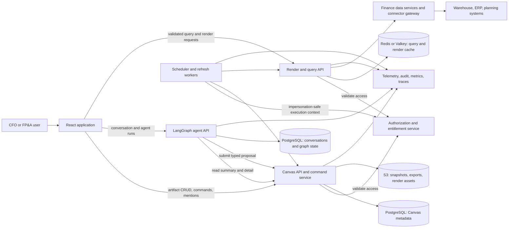
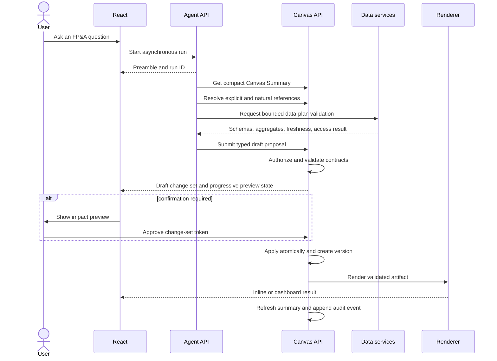
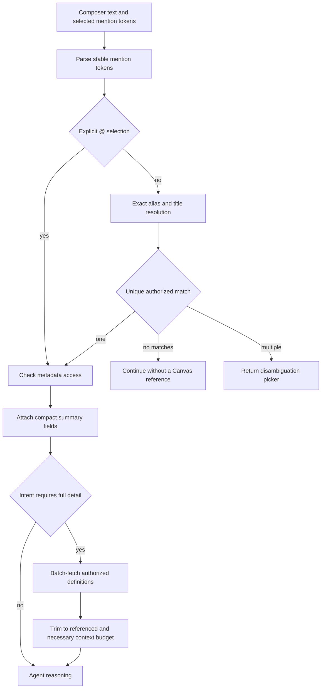
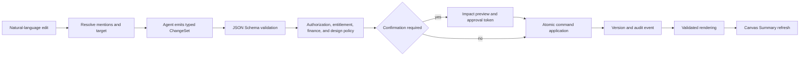
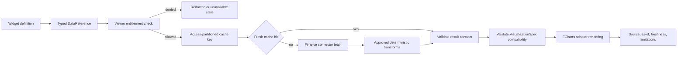
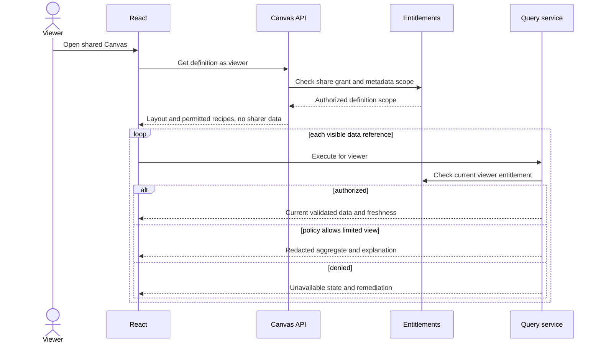
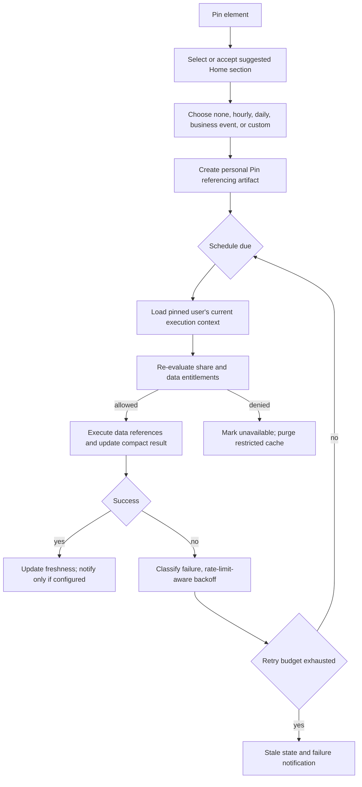
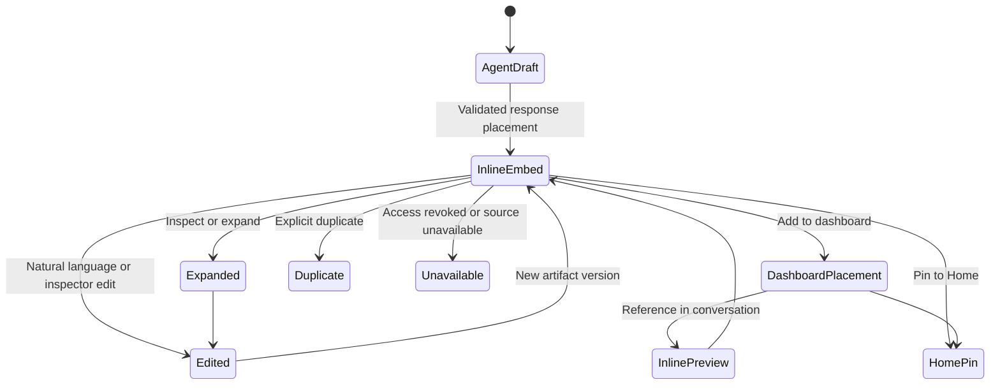
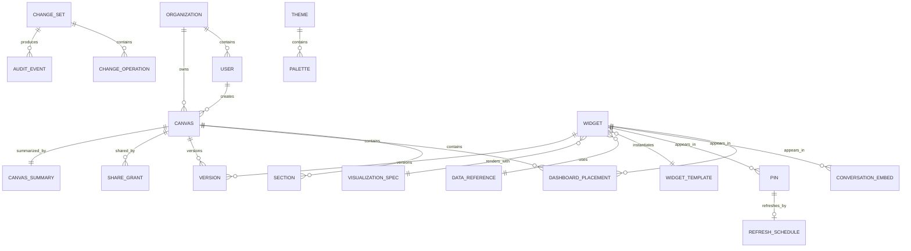

# Canvas Technical Architecture and Delivery Plan

Status: Phase 2 proposal  
Audience: Product, design, frontend, agent, platform, data, security, and delivery teams  
Primary users: CFOs and FP&A teams  
Primary layout engine: GridStack  
Primary chart renderer: Apache ECharts behind an application-owned adapter

## 1. Executive decisions

Canvas is an entitlement-aware artifact system, not an agent-controlled UI. The LangGraph agent may interpret intent and propose typed change sets. Only the deterministic Canvas command layer may validate, authorize, persist, and apply those changes.

The implementation is based on these fixed product decisions:

- Desktop-only MVP.
- Internal warehouse, ERP, and planning data only.
- Source systems are read-only. Local scenario assumptions and derived analyses are allowed.
- Personal drafts are private by default; explicit named-user and team-workspace sharing is supported.
- No public links, central gallery, comments, approvals, or live co-editing in MVP.
- Inline, dashboard, and Home representations reference the same logical artifact.
- Home pins remain linked to the source artifact by default.
- Generation is asynchronous, beginning with a fast preamble and continuing with progress and partial results.
- Safe, reversible presentation edits apply immediately; destructive, data-reference, bulk, forecast-impacting, scheduling, and permission changes require confirmation.
- Scheduled refresh is off by default and runs under the pinned user's current permissions.
- Live shared views re-evaluate viewer entitlements. Static snapshots are separate policy-controlled objects.
- WCAG 2.2 AA is an acceptance criterion.
- The always-on Canvas Summary is capped near 1,000 tokens.
- Organization themes and palettes are governed; user overrides are limited.

## 2. Architectural principles and boundaries

1. **Artifacts are durable; placements are contextual.** A widget is a logical artifact. Conversation embeds, dashboard placements, and Home pins point to it.
2. **Data is referenced, not copied.** A widget stores a typed `DataReference`, transformation recipe, freshness policy, and compact result summary—not a durable copy of source data.
3. **The agent proposes; deterministic services decide.** The agent cannot write PostgreSQL, mutate GridStack, call source systems directly, or emit executable visualization code.
4. **Authorization is evaluated at every use.** A stored recipe is not permission to execute it. Every viewer, export, refresh, and scheduled run is re-authorized.
5. **Rendering is downstream of validation.** The renderer receives a versioned, approved `VisualizationSpec` and validated dataset contract.
6. **Summaries are indexes, not truth.** Canvas Summary is a compact derivative that can be regenerated from authoritative metadata and current access state.
7. **PostgreSQL owns relational truth.** S3 stores immutable export/snapshot/render assets, never dashboard metadata or permissions.
8. **Audit history is append-only.** Undo creates a new inverse change set; it never deletes history.
9. **Caches are access-partitioned and disposable.** Cache entries include an entitlement fingerprint and may never be treated as authorization evidence.
10. **GridStack is an adapter.** Persisted placements use the Canvas layout schema. GridStack coordinates are generated from and written back through typed commands.

## 3. Reference architecture

### 3.1 System and component architecture



Boundary rules:

- The React application never contacts finance sources directly.
- The LangGraph API receives compact summaries and approved query results; it never receives database credentials or unrestricted source responses.
- The Canvas API owns domain validation, permission checks, versions, change sets, shares, pins, schedules, and summaries.
- The render/query API owns data-reference execution, schema validation, transformations, renderer adaptation, and ephemeral result caching.
- Authorization and entitlements are called both before metadata disclosure and before data execution.
- Conversation/LangGraph state and Canvas metadata may share a PostgreSQL cluster, but use separate schemas, roles, migrations, and access paths.

### 3.2 Generate a dashboard or widget



### 3.3 Resolve `@` mentions and retrieve detail on demand



Mention resolution occurs before LLM reasoning. Unauthorized items are excluded rather than returned as redacted search hits. Explicit mention tokens contain stable IDs and display text; the server never trusts a client-provided title as identity.

### 3.4 Natural-language edit flow



### 3.5 Data-reference execution



### 3.6 Viewer-specific dashboard sharing



### 3.7 Home pin and scheduled refresh



Business-event schedules use the organization's configured calendar and timezone. Market-open and market-close triggers remain supported by the schedule type model but are disabled in the internal-data MVP.

### 3.8 Inline element lifecycle



“Add this to my dashboard” creates a `DashboardPlacement` pointing to the existing artifact unless the user explicitly duplicates or an incompatible ownership boundary requires a fork.

### 3.9 Storage and domain relationships



## 4. Domain model

All IDs are UUIDv7 or equivalent time-sortable opaque identifiers. Every organization-scoped table includes `organization_id`, timestamps, and a soft-deletion field where applicable. Definitions use JSONB only for versioned, schema-validated payloads; relational fields remain relational.

| Entity | Core fields | Ownership and lifecycle | Access and relationships |
|---|---|---|---|
| **Canvas** | `id`, `organization_id`, `owner_user_id`, `title`, `alias`, `status`, `current_version`, `theme_id`, `created_from_run_id` | Private draft → saved → shared/published → archived; soft-delete then retention purge | Root permission boundary; contains sections and placements |
| **Dashboard** | `canvas_id`, `layout_schema_version`, `default_time_range`, `filter_set`, `display_settings` | One dashboard presentation per Canvas in MVP | Uses Canvas grants; contains `DashboardPlacement` records |
| **Section** | `id`, `canvas_id`, `title`, `alias`, `order`, `layout_bounds`, `collapsed` | Created, renamed, moved, archived | Mentionable; contains placements by `section_id` |
| **Widget** | `id`, `organization_id`, `owner_user_id`, `title`, `alias`, `template_id`, `data_reference_id`, `visualization_spec_id`, `current_version`, `status`, `latest_result_summary` | Logical artifact may outlive a placement; archived when no longer referenced and explicitly deleted | Access is intersection of artifact permission and data entitlement |
| **WidgetTemplate** | `id`, `key`, `version`, `category`, `data_contract`, `default_spec`, `editable_paths`, `surface_capabilities`, `policy_rules`, `status` | Admin-managed draft → approved → deprecated → retired | Organization or system scoped; immutable after approval except new version |
| **WidgetInstance** | Logical view of `Widget` plus resolved template version and current settings | Not a separate table unless performance requires it | Composes template, data reference, spec, and settings |
| **DashboardPlacement** | `id`, `canvas_id`, `section_id`, `artifact_id`, `x`, `y`, `w`, `h`, `min_w`, `min_h`, `z`, `placement_settings` | Created/moved/resized/removed without copying artifact | GridStack adapter consumes this schema |
| **ConversationEmbed** | `id`, `conversation_id`, `message_id`, `artifact_id`, `presentation_mode`, `created_from_run_id` | Immutable message association; presentation settings may version | Conversation access plus artifact access required |
| **DataReference** | `id`, `provider_id`, `connector_id`, `contract_version`, `query_type`, `parameters`, `time_range`, `transforms`, `field_mapping`, `freshness_policy`, `entitlement_requirements`, `schema_hash` | Versioned; immutable versions; no raw SQL or executable code | Executed only through finance data service under viewer context |
| **VisualizationSpec** | `id`, `dsl_version`, `template_key`, `primitives`, `encodings`, `axes`, `annotations`, `interaction_policy`, `token_bindings`, `renderer_capabilities` | Versioned and schema validated | Never contains callbacks, code, external URLs, or raw HTML |
| **Theme** | `id`, `organization_id`, `key`, `version`, `mode`, `semantic_tokens`, `status` | Admin-approved, versioned, deprecable | Used by Canvas and specs through token references |
| **Palette** | `id`, `theme_id`, `key`, `version`, `categorical_tokens`, `sequential_tokens`, `diverging_tokens`, `semantic_rules`, `contrast_results` | Governed workflow; immutable approved versions | User chooses approved palette; limited safe overrides only |
| **CanvasSummary** | `canvas_id`, `summary_version`, `source_version`, `generated_at`, `token_estimate`, `payload`, `stale_reasons` | Derived and replaceable; refreshed after relevant events | Filtered for requesting session/user before agent use |
| **MentionableElement** | `entity_id`, `entity_type`, `title`, `aliases`, `location`, `access_scope`, `compact_summary`, `search_vector` | Materialized search projection, event-refreshed | Search results are permission-filtered before return |
| **ChangeSet** | `id`, `organization_id`, `actor`, `origin`, `base_versions`, `status`, `risk_level`, `requires_confirmation`, `approval_token_hash`, `idempotency_key`, `request_id` | Proposed → validated → awaiting approval → applied/rejected/expired | Contains ordered operations and one atomic audit boundary |
| **ChangeOperation** | `id`, `change_set_id`, `sequence`, `kind`, `target_id`, `payload`, `preconditions`, `inverse_operation` | Immutable after validation | Applied only by registered deterministic handler |
| **Version** | `id`, `entity_type`, `entity_id`, `version_number`, `definition`, `change_set_id`, `created_by` | Append-only immutable snapshot | Supports compare, restore, and audit |
| **AuditEvent** | `id`, `organization_id`, `actor`, `action`, `target`, `outcome`, `policy_decision`, `request_id`, `trace_id`, `metadata`, `occurred_at` | Append-only; retention policy controlled | Sensitive values excluded; hashes/IDs used for correlation |
| **Pin** | `id`, `owner_user_id`, `artifact_id`, `home_section_id`, `order`, `display_settings`, `status`, `last_success_at`, `last_failure` | Personal by default; linked to artifact | Owner's access checked on view and refresh |
| **RefreshSchedule** | `id`, `pin_id`, `schedule_type`, `timezone`, `business_calendar_id`, `expression`, `enabled`, `next_run_at`, `retry_policy` | Off by default; paused on repeated policy failure | Executes only as pin owner with current entitlements |
| **User** | `id`, `organization_id`, `identity_subject`, `status`, `locale`, `timezone` | Synchronized from identity service | Never used as an entitlement cache by itself |
| **Organization** | `id`, `workspace_policy`, `retention_policy`, `snapshot_policy`, `theme_policy` | Tenant boundary | Parent of all organization-scoped resources |
| **ShareGrant** | `id`, `canvas_id`, `grantee_type`, `grantee_id`, `permission`, `granted_by`, `expires_at`, `revoked_at` | Explicit grant, revocable and auditable | MVP grantees: named user or team workspace |
| **Permission** | `resource`, `principal`, `action`, `decision`, `reason`, `evaluated_at` | Runtime decision, not necessarily persisted | Actions: discover, view_definition, query_data, edit, duplicate, share, export, schedule |

Artifact deletion is two-stage. Removing a placement does not delete the Widget. Explicit artifact deletion moves it to a recoverable trash state. Existing embeds and pins show a source-deleted state during the recovery window.

## 5. LangGraph and deterministic command design

### 5.1 Graph state

```text
CanvasAgentState
  request_id
  run_id
  actor_context
  conversation_id
  user_intent
  mention_tokens[]
  resolved_mentions[]
  disambiguation_request?
  canvas_summary
  retrieved_details[]
  template_candidates[]
  data_plan?
  bounded_query_results[]
  visualization_plan?
  proposed_change_set?
  validation_results[]
  approval_state?
  persistence_result?
  render_result?
  token_usage
  trace_context
```

### 5.2 Required graph nodes

1. **Intent classification** — Classifies create, inspect, reference, edit, save, share, pin, schedule, export, or clarify. This node cannot select targets.
2. **Mention resolution** — Deterministic service resolves explicit tokens first and exact natural references second. Multiple matches interrupt with disambiguation.
3. **Context retrieval** — Loads the 1,000-token Canvas Summary, then authorized full definitions only for resolved targets and directly necessary neighbors.
4. **Template ranking** — Filters templates deterministically by data contract, surface, policy, and renderer capability; the model may rank the remaining candidates with reasons.
5. **Data planning** — Produces typed `DataReferenceDraft` objects. It cannot emit SQL. Finance data service validates connector/query contracts and returns schema/estimated cost.
6. **Visualization planning** — Selects an approved template first. Fallback emits the strict visualization DSL only.
7. **Change-set creation** — Emits a typed `ChangeSetProposal` with base versions and stable target IDs.
8. **Validation and policy enforcement** — Canvas service checks schemas, access, entitlements, finance rules, theme tokens, performance bounds, and concurrency.
9. **User approval** — Graph pauses with an expiring, server-issued approval token when risk policy requires confirmation.
10. **Persistence** — Agent invokes the command API using the approved token; it never writes storage directly.
11. **Rendering** — Render service executes authorized data references and translates the approved spec through the ECharts adapter.
12. **Summary refresh** — Canvas service refreshes structural summary synchronously and value/freshness fields asynchronously when necessary.
13. **Audit logging** — Every node records bounded telemetry; policy decisions and command outcomes generate immutable audit events.

Failures are typed as `clarification_required`, `ambiguous_reference`, `access_denied`, `entitlement_denied`, `schema_mismatch`, `query_too_expensive`, `invalid_visualization`, `confirmation_required`, `version_conflict`, `source_unavailable`, or `internal_error`.

## 6. Typed edit-operation model

### 6.1 Common command envelope

```json
{
  "changeSetId": "cs_...",
  "idempotencyKey": "client-generated-uuid",
  "requestId": "req_...",
  "origin": "agent|inspector|toolbar|direct_manipulation",
  "baseVersions": {"canvas_123": 17, "widget_456": 8},
  "operations": [
    {
      "operationId": "op_...",
      "kind": "resize_widget",
      "targetId": "placement_789",
      "payload": {"w": 6, "h": 4},
      "preconditions": [{"type": "entity_version", "entityId": "canvas_123", "equals": 17}]
    }
  ]
}
```

Common behavior:

- Idempotency is enforced by unique `(organization_id, idempotency_key)` and operation IDs.
- Validation runs without mutation and returns normalized operations, warnings, risk, confirmation requirement, query cost, and predicted inverse operations.
- Application occurs in one database transaction after rechecking versions and permissions.
- Undo applies a new change set containing stored or deterministically recomputed inverse operations.
- Every operation records actor, origin, request, trace, before/after hashes, target versions, policy decision, and timestamp.
- A version mismatch returns `409 version_conflict` with current versions and affected JSON paths.
- Safe automatic rebase is allowed only for disjoint presentation paths. Deletes, data-reference changes, aliases, shares, schedules, and overlapping layout changes never auto-rebase.

### 6.2 Operation registry

| Operation | Required payload | Preconditions and validation | Confirmation | Undo and conflicts |
|---|---|---|---|---|
| `create_dashboard` | `title`, optional `alias`, `themeId` | Create permission; unique alias in scope; approved theme | No | Undo archives dashboard if no later dependent edits |
| `add_widget` | `canvasId`, `artifactId` or validated draft, `sectionId`, placement | Edit permission; artifact access; compatible surface; GridStack bounds; widget limit | Only if draft introduces new data reference | Remove placement; delete new artifact only if unreferenced |
| `update_widget` | Whitelisted JSON Patch paths and values | Paths must be template-editable; spec remains valid | Risk-based; data/meaning changes confirm | Inverse patch; reject overlapping path changes |
| `remove_widget` | `placementId`, optional `deleteArtifact` | Placement exists; deleteArtifact requires no protected references | Placement removal no; artifact deletion yes | Restore placement/artifact during retention window |
| `move_widget` | `placementId`, `x`, `y`, optional `sectionId` | Bounds, collision and section access; normalized through GridStack adapter | No | Restore prior coordinates; conflict on same placement |
| `resize_widget` | `placementId`, `w`, `h` | Template min/max, bounds, renderer minimum size | No | Restore dimensions; conflict on same placement |
| `replace_widget_type` | `widgetId`, `templateId`, optional mapping | Source contract compatible; no misleading conversion; preview render succeeds | Yes when semantics or fields change | Restore previous template/spec |
| `update_filters` | `targetId`, filter expression | Approved fields/operators; entitlement-safe values; query cost within limits | No for private draft; yes for shared locked output | Restore prior filter set; overlapping filter conflict |
| `update_time_range` | `targetId`, normalized range | Source supports range; period/fiscal calendar valid | Same rule as filters | Restore range |
| `update_data_reference` | `widgetId`, typed reference draft | Connector contract, entitlement, schema, cost, provenance | Always | Restore previous reference version; never auto-rebase |
| `apply_theme` | `canvasId` or `widgetId`, approved `themeId`/`paletteId` | Approved, active, WCAG checks pass | No | Restore previous token binding |
| `duplicate_widget` | `widgetId`, destination and copy mode | View + duplicate permission; data recipe can be shared into destination | No | Remove duplicate; source untouched |
| `rename_widget` | `widgetId`, `title` | Length/content policy; no misleading certified label | No | Restore title; last-writer conflict |
| `set_alias` | `entityId`, `alias` | Normalized and unique in mention scope; reserved words denied | No | Restore alias; uniqueness conflict |
| `pin_element` | `artifactId`, `homeSectionId`, optional schedule | Artifact accessible; Home section owned; schedule policy valid | Confirm when schedule is non-none | Remove pin and schedule |
| `unpin_element` | `pinId` | Pin owned by actor | No | Recreate pin with previous placement if source accessible |
| `set_refresh_schedule` | `pinId`, schedule definition | Schedule quota, timezone/calendar, minimum interval | Always | Restore prior schedule; no automatic rebase |
| `undo_change_set` | `targetChangeSetId` | Target reversible; no incompatible dependent versions; current permission | Confirm if shared output, data reference, or schedule affected | Redo is a new inverse-of-inverse change set |

Direct GridStack events are debounced into `move_widget` and `resize_widget` operations. The UI may show optimistic movement, but persistence and final layout are confirmed by the command response.

## 7. API design

All endpoints are under `/v1`, require an authenticated identity, propagate `request-id` and W3C trace context, and use organization context derived from the server-side session rather than a trusted client header.

### 7.1 API groups

- **Artifact APIs:** deterministic Canvas/dashboard/widget reads and lifecycle operations.
- **Agent proposal APIs:** draft and validate proposals; never bypass command application.
- **Command APIs:** validate, approve, apply, undo, and redo typed change sets.
- **Render/query APIs:** entitlement-aware data execution, previews, exports, lineage, and freshness.
- **Administration APIs:** templates, connectors, themes, palettes, calendars, quotas, and policies.

### 7.2 Endpoint inventory

```text
Artifact APIs
  POST   /canvases
  GET    /canvases/{canvasId}
  PATCH  /canvases/{canvasId}                 # lifecycle metadata only
  DELETE /canvases/{canvasId}                 # soft delete
  GET    /canvases/{canvasId}/versions
  GET    /canvases/{canvasId}/versions/{n}
  GET    /canvases/{canvasId}/summary
  POST   /canvas-details:batchGet
  GET    /widgets/{widgetId}
  GET    /home/sections

Mention APIs
  GET    /mentions/search?q=&types=&contextId=
  POST   /mentions/resolve

Template APIs
  GET    /templates?surface=&category=&schema=
  GET    /templates/{key}/versions/{version}

Agent proposal APIs
  POST   /agent/proposals
  POST   /agent/proposals/{proposalId}:preview

Command APIs
  POST   /change-sets:validate
  POST   /change-sets/{changeSetId}:approve
  POST   /change-sets/{changeSetId}:apply
  POST   /change-sets/{changeSetId}:reject
  POST   /change-sets/{changeSetId}:undo
  POST   /change-sets/{changeSetId}:redo

Inline APIs
  POST   /conversation-embeds
  GET    /conversation-embeds/{embedId}
  POST   /conversation-embeds/{embedId}:addToDashboard

Home and scheduling APIs
  POST   /pins
  PATCH  /pins/{pinId}
  DELETE /pins/{pinId}
  PUT    /pins/{pinId}/schedule
  DELETE /pins/{pinId}/schedule
  POST   /pins/{pinId}:refresh

Sharing APIs
  GET    /canvases/{canvasId}/shares
  POST   /canvases/{canvasId}/shares
  DELETE /canvases/{canvasId}/shares/{grantId}

Render and query APIs
  POST   /data-references:validate
  POST   /query-jobs
  GET    /query-jobs/{jobId}
  POST   /render-jobs
  GET    /render-jobs/{jobId}
  POST   /exports
  GET    /exports/{exportId}
  GET    /widgets/{widgetId}/lineage
  GET    /widgets/{widgetId}/freshness

Admin APIs
  POST   /admin/templates
  POST   /admin/templates/{key}/versions/{version}:approve
  POST   /admin/themes
  POST   /admin/palettes
  POST   /admin/palettes/{id}:approve
  POST   /admin/connectors
  PUT    /admin/business-calendars/{id}
  PUT    /admin/policies/canvas
```

### 7.3 Mention resolution example

```json
POST /v1/mentions/resolve
{
  "conversationId": "conv_1",
  "canvasId": "canvas_1",
  "references": [
    {"kind": "explicit", "entityId": "widget_7"},
    {"kind": "natural", "text": "revenue trend"}
  ]
}
```

```json
{
  "resolved": [{"inputIndex": 0, "entityId": "widget_7", "type": "widget", "summary": {}}],
  "ambiguous": [{
    "inputIndex": 1,
    "candidates": [
      {"entityId": "widget_7", "title": "Revenue Trend", "location": "FY27 Plan / Revenue"},
      {"entityId": "widget_9", "title": "Revenue Trend", "location": "Board Pack / Overview"}
    ]
  ]
}
```

### 7.4 Proposal and command example

The agent submits a proposal, not a mutation:

```json
POST /v1/agent/proposals
{
  "runId": "run_1",
  "intent": "edit",
  "resolvedTargetIds": ["widget_7"],
  "changeSet": {
    "idempotencyKey": "f970...",
    "baseVersions": {"widget_7": 8},
    "operations": [{
      "operationId": "op_1",
      "kind": "replace_widget_type",
      "targetId": "widget_7",
      "payload": {"templateId": "actual_vs_plan_combo@2"}
    }]
  }
}
```

Validation response:

```json
{
  "changeSetId": "cs_1",
  "status": "awaiting_confirmation",
  "riskLevel": "medium",
  "warnings": ["The chart encoding changes from a single trend to actual-versus-plan."],
  "preview": {"renderJobId": "render_12", "changedPaths": ["/template", "/encodings"]},
  "approvalExpiresAt": "2026-07-30T22:00:00Z"
}
```

The approval endpoint returns a one-use token bound to the actor, change-set hash, versions, and expiry. Apply rechecks all inputs and consumes the token atomically.

### 7.5 Asynchronous job contract

```json
{
  "jobId": "job_1",
  "status": "queued|running|partial|succeeded|failed|cancelled",
  "stage": "planning_data",
  "progress": 0.35,
  "partialArtifacts": ["widget_draft_1"],
  "retryable": true,
  "error": null,
  "links": {"events": "/v1/jobs/job_1/events"}
}
```

Server-Sent Events are sufficient for MVP progress streaming. WebSockets are not required without live co-editing.

## 8. PostgreSQL, cache, and S3 design

### 8.1 PostgreSQL schemas and roles

Recommended logical schemas:

```text
conversation.*   existing conversations and LangGraph checkpoints
canvas.*         canvases, widgets, placements, data references, specs, versions
identity_ref.*   local references to users, teams, organizations; not the identity source
sharing.*        grants and revocations
home.*           sections, pins, schedules
audit.*          append-only audit events
jobs.*           generation, query, render, export, and refresh jobs
config.*         template, theme, palette, connector, and business-calendar versions
```

Use separate database roles for the conversation service, Canvas service, worker, renderer, and migration runner. Application roles cannot modify `audit.audit_events` except through a narrowly scoped append function. Enable PostgreSQL row-level security as defense in depth using server-set transaction context for organization and actor; service authorization remains the primary policy engine.

### 8.2 Important tables and indexes

```text
canvas.canvases
  PK id
  INDEX (organization_id, owner_user_id, updated_at DESC)
  UNIQUE (organization_id, normalized_alias) WHERE deleted_at IS NULL

canvas.widgets
  PK id
  INDEX (organization_id, owner_user_id, updated_at DESC)
  INDEX (data_reference_id)

canvas.dashboard_placements
  PK id
  INDEX (canvas_id, section_id, y, x)
  UNIQUE (canvas_id, artifact_id, id)  # allows multiple placements intentionally

canvas.entity_versions
  UNIQUE (entity_type, entity_id, version_number)
  INDEX (change_set_id)

canvas.change_sets
  UNIQUE (organization_id, idempotency_key)
  INDEX (status, expires_at)

canvas.mention_index
  GIN (search_vector)
  GIN (aliases gin_trgm_ops)
  INDEX (organization_id, entity_type, updated_at DESC)

sharing.share_grants
  INDEX (canvas_id, revoked_at)
  INDEX (grantee_type, grantee_id, revoked_at)

home.refresh_schedules
  INDEX (enabled, next_run_at) WHERE enabled = true

jobs.jobs
  INDEX (status, available_at, priority)
  UNIQUE (job_type, idempotency_key)

audit.audit_events
  INDEX (organization_id, occurred_at DESC)
  INDEX (target_type, target_id, occurred_at DESC)
  INDEX (request_id)
```

Use `FOR UPDATE SKIP LOCKED` for the MVP PostgreSQL-backed worker queue. A worker lease includes `locked_by`, `locked_at`, `lease_expires_at`, attempt count, and heartbeat. Promote to a managed queue only after measured throughput or operational requirements justify it.

### 8.3 Versioning and migrations

- Every mutable definition has an integer `current_version` and immutable version snapshots.
- JSON schemas have explicit versions and upgrade functions. Never reinterpret old JSON using only the newest schema.
- Database migrations are forward-only, reviewed, transactional where PostgreSQL permits, and tested against production-scale fixtures.
- Breaking template/spec changes create new versions and a compatibility migration plan; existing artifacts remain pinned until migrated.
- Deprecation telemetry identifies active artifacts before a template or palette is retired.

### 8.4 S3 object layout

```text
s3://canvas-assets/{organization_id}/
  snapshots/{canvas_id}/{snapshot_id}/definition.json
  snapshots/{canvas_id}/{snapshot_id}/preview.svg
  exports/{export_id}/report.pdf
  exports/{export_id}/image.png
  exports/{export_id}/data.xlsx
  renders/{spec_hash}/{render_id}/preview.svg
  imports/{import_id}/quarantine/...       # future; no MVP spreadsheet ingestion
```

PostgreSQL stores object ID, bucket/key, checksum, media type, size, classification, creator, source version, entitlement decision, retention class, and KMS key reference. Clients receive short-lived signed URLs only after authorization. Bucket listing is never exposed.

Object controls:

- Block public access; use organization-scoped KMS encryption.
- Immutable snapshots use object lock only if policy requires it.
- Lifecycle-delete transient render previews quickly; retain approved snapshots/exports according to organization policy.
- Validate file signatures and content types; never trust extensions.
- Exports cannot load arbitrary remote URLs, fonts, images, or scripts.

### 8.5 Cache strategy and invalidation

Recommended cache tiers:

1. React/TanStack Query: metadata and job state, scoped to authenticated session.
2. Redis/Valkey: query results, template/spec translations, mention projections, render job coordination.
3. S3: immutable or expensive generated assets, never live authorization state.

Query cache key:

```text
sha256(
  data_reference_version + normalized_parameters + transformation_version +
  source_generation + viewer_entitlement_fingerprint + policy_version
)
```

The fingerprint is an opaque hash returned by the entitlement service and contains no permissions in logs. Cache reads recheck that the current fingerprint matches. Revocation events evict related entries; TTL is a backup, not the primary revocation mechanism.

Suggested initial TTLs:

- Mention search: 30 seconds, permission-version keyed.
- Canvas metadata: 60 seconds with ETags and event invalidation.
- Query results: source/freshness-specific, normally 5–15 minutes.
- Rendered previews: 24 hours if the underlying spec/data summary is unchanged.
- Canvas Summary: no fixed truth TTL; event-stale detection plus a 5-minute verification window.

Summary refresh triggers include title/alias changes, placement changes, artifact versions, pin changes, share/access changes, compact headline changes, freshness transitions, and deletion/restoration. A summary is stale when `source_version` is behind the Canvas version, any included artifact version changed, access-policy version changed, or freshness crossed a policy threshold.

### 8.6 Retention

Recommended defaults, subject to approval:

- Recoverable deleted artifacts: 30 days.
- Agent proposals and previews not applied: 7 days.
- Query caches: minutes to hours; never long-term archives.
- Render previews: 24 hours.
- Job operational records: 30 days, with aggregated metrics retained longer.
- Audit events and approved snapshots: organization policy, default 7 years only if enterprise policy requires it; otherwise shorter.
- Conversation retention remains independently controlled by the conversation service.

## 9. Template and fallback system

### 9.1 Common template contract

Every template defines:

```text
TemplateContract
  key and semantic version
  supported surfaces
  required dimensions[]: name, semantic role, type, cardinality limits
  required measures[]: name, type, unit, currency, aggregation, favorable direction
  optional fields[]
  time semantics and fiscal calendar requirements
  scenario semantics
  default VisualizationSpec
  editable paths
  approved transforms
  palette/token rules
  accessibility rules
  performance bounds
  recommendation rules
  prohibited uses
```

Universal rules:

- Templates consume semantic tokens, never literal LLM-selected colors.
- Favorable/unfavorable coloring requires a metric-specific direction; positive numbers are not automatically favorable.
- Every chart has a title, units, source, as-of time, concise takeaway, keyboard-reachable controls, and equivalent table or textual summary.
- Truncated axes, dual axes, stacking, cumulative totals, percentages, and forecasts require explicit validation rules.
- Pie/donut is limited to a true whole, non-negative values, mutually exclusive categories, and at most six displayed categories including “Other.”
- Inline templates have compact defaults and limited interactions; full detail opens in inspect/expanded mode.

### 9.2 General template catalog

Legend: `I` inline, `D` dashboard, `H` Home. All accessibility requirements inherit the universal rules.

| Template | Data contract and default | Editable fields | Recommend when | Prohibited or misleading uses | Surfaces |
|---|---|---|---|---|---|
| KPI | One measure, optional prior/target and period; KPI card | Title, comparison, precision, emphasis token | One decision-critical value | Missing unit/as-of or unsupported aggregation | I/D/H |
| Trend | Time dimension + 1–5 measures; line/area | Range, interval, series, markers | Change over ordered time | Categorical non-time ordering represented as time | I/D/H |
| Comparison | Category + measures; grouped bar/combo | Sort, orientation, baseline, labels | Compare categories or plan/actual | Too many categories without ranking/scroll | I/D/H |
| Ranking | Category + measure; sorted horizontal bar/table | Top/bottom N, sort, ties | Ordered performance | Implying significance from tiny differences | I/D/H |
| Table | Typed rows/columns; accessible data table | Columns, sort, filters, totals, density | Exact values and detail | Unbounded client rows or hidden units | I/D/H |
| Heatmap | Two bounded dimensions + measure; matrix heatmap | Scale, clustering, labels | Pattern across two dimensions | Diverging scale without meaningful midpoint | I/D |
| Timeline | Time + typed events; event rail | Event types, range, grouping | Milestones and status changes | Quantitative magnitude without encoding | I/D |
| Distribution | Numeric measure + optional category; histogram/box | Bins, percentile markers, grouping | Spread and outliers | Small samples without disclosure | I/D |
| Map | Geography + measure; choropleth/symbol map | Region level, scale, labels | Genuine spatial questions | Size/count without normalization when rates are intended | D |
| Funnel | Ordered stages + counts; funnel/bar | Stages, conversion labels | Strict sequential conversion | Independent categories or reversible stages | I/D |
| Narrative insight | Claims + evidence refs; structured text panel | Tone, length, included evidence | Explain drivers and limitations | Unsupported causal claims or uncited numbers | I/D/H |

### 9.3 Finance-specific catalog

MVP priority uses internal FP&A templates. Market-security templates remain registered as future catalog entries but disabled without approved external providers and licenses.

| Template | Status | Contract and default | Editable and recommendation rules | Prohibited uses | Surfaces |
|---|---|---|---|---|---|
| Quote card | Future | Instrument, price, change, as-of; quote KPI | Range/comparison; only with licensed market feed | Delayed price presented as real-time | I/D/H |
| Price/volume | Future | Time, price, volume; line/candlestick + volume | Range, interval, adjustments | Mixed adjusted/unadjusted series | I/D |
| Candlestick | Future | Time, OHLC, optional volume; candlestick | Interval, gain/loss token set | Non-OHLC or irregular aggregation without disclosure | I/D |
| Relative performance | Future | Common time range + indexed series; indexed line | Baseline and benchmark | Different calendars/currencies without normalization | I/D/H |
| Portfolio allocation | Future | Holdings, weights, asset class; bar/donut | Grouping, target overlay | Weights not reconciling to whole | I/D/H |
| P&L | **MVP** | Accounts/categories, periods, actual/plan/forecast; statement table + KPI | Period, scenario, hierarchy, currency | Mixed currencies or sign conventions without normalization | I/D/H |
| Cost-center variance matrix | **MVP** | Cost center, period, actual, plan, variance amount/percent; diverging heatmap + accessible table | Period, hierarchy, amount/percent, materiality threshold | Favorable/unfavorable colors without account-specific sign semantics | D/H |
| Drawdown | Future | Time + value/index; underwater area | Range, benchmark | Non-continuous series without gaps shown | I/D |
| Exposure | Later internal | Dimension + exposure measure; diverging bars/heatmap | Dimension, gross/net, limits | Net hiding gross concentration | I/D/H |
| Factor attribution | Later | Factors + contribution + residual; waterfall/table | Period, hierarchy, residual | Contributions not reconciling to total | I/D |
| Valuation | Later internal | Drivers, forecast periods, outputs; KPI + sensitivity | Case, discount/terminal assumptions | Unsupported precision or unlabeled assumptions | I/D/H |
| Fundamentals | **MVP** | Internal financial metrics by period; scorecard/trends | Metric set, period, actual/plan/forecast | Combining incompatible accounting definitions | I/D/H |
| Earnings | Future external | Reported/estimate/surprise/events | Range, metric | Unlicensed consensus or stale releases | I/D/H |
| Estimates | Future external | Period, consensus, range, analyst count | Horizon, statistic | Consensus without contributor count/as-of | I/D |
| Analyst revisions | Future external | Time, estimate revisions, contributors | Window, metric | Treating revisions as actuals | I/D |
| Peer comparison | Later | Entities + normalized metrics; bar/table | Peers, metric, normalization | Non-comparable definitions/periods | I/D/H |
| Options | Future external | Expiry, strike, call/put metrics; chain/vol surface | Expiry, metric | Stale or incomplete chain; investment guidance claims | D |
| Ownership | Future external | Holder/type/weight/as-of; table/bar | Holder class, date | Double-counted or outdated filings | I/D |
| Filings | Future external | Document metadata, sections, extracted facts | Filing type, date | Unverified extraction presented as reported fact | I/D |
| News/events | Future external | Event, source, time, entities; timeline/list | Sources, event types | Untrusted content executed or treated as instructions | I/D/H |
| Macro | Future external | Series, geography, period, revision; trend | Frequency, transformation | Mixed seasonal adjustment/release vintage | I/D/H |
| Economic calendar | Future external | Event, scheduled time, actual/forecast/prior | Region, impact | Timezone or revision ambiguity | I/D/H |
| Watchlist | Later | Entities/metrics/thresholds; table/KPI strip | Metrics, ordering, alerts | Implicit entitlement to underlying data | I/D/H |
| Risk | Later internal | Risk metric, limit, period, dimension; heatmap/KPI | Limits, hierarchy, horizon | Mixing incomparable risk horizons | I/D/H |
| Scenario analysis | **MVP** | Scenario, drivers, outputs, periods; comparison + sensitivity | Local assumptions, cases, outputs | Presenting local scenarios as source forecast | I/D/H |
| Driver sensitivity | **MVP** | Driver, low/base/high assumption, output impact; tornado + table | Output metric, driver set, assumption range | Implying probability or causality beyond the modeled assumptions | D/H |
| Actual vs plan | **MVP** | Period, actual, plan, variance; combo + table | Period, dimension, favorable direction | Variance sign without metric semantics | I/D/H |
| Variance bridge | **MVP** | Start, ordered drivers, end; waterfall | Driver order, grouping, materiality | Drivers that do not reconcile to total | I/D/H |
| Driver tree | **MVP** | Directed acyclic metric relationships; tree | Expansion, depth, scenario | Cycles or causal language without modeled relationship | I/D |
| Headcount plan | **MVP** | Org/time, actual/plan hires and cost; combo/table | Org level, period, status | Exposing restricted employee-level data | I/D/H |
| Cash runway | **MVP** | Opening cash, inflow/outflow forecast; trend/KPI | Scenario, horizon, cash definition | Omitting liquidity assumptions | I/D/H |

### 9.4 LLM visualization fallback

Fallback is permitted only after no approved template satisfies the validated data contract.

```json
{
  "dslVersion": "1.0",
  "primitive": "cartesian",
  "series": [{"mark": "bar", "x": "department", "y": "variance"}],
  "axes": [{"field": "variance", "unit": "USD"}],
  "tokens": {"positive": "semantic.favorable", "negative": "semantic.unfavorable"},
  "interactions": ["tooltip", "select", "inspect_table"]
}
```

Validation sequence:

1. JSON Schema and DSL version.
2. Approved primitive and interaction allowlist.
3. Field existence, type, cardinality, unit, and aggregation compatibility.
4. Finance rules including sign direction, reconciliation, currency, period, and scenario labels.
5. Theme token, contrast, color-blind, and non-color encoding rules.
6. Renderer capability and minimum size.
7. Complexity limits: series, marks, axes, labels, data points, annotations.
8. Accessibility description and equivalent-table generation.
9. Safe preview render in an isolated worker.

Invalid or low-confidence output returns a clarification or recommends the closest approved template. Store generated-spec metadata, validation failures, user corrections, render outcomes, and promotion candidates. Promotion to a template requires human review, test fixtures, policy approval, versioning, and documentation.

## 10. Security and entitlement enforcement

### 10.1 Threat model

| Threat | Example | Controls |
|---|---|---|
| Shared-dashboard leakage | Recipient receives creator's cached actuals | Share definitions only; viewer-specific query; access-fingerprint cache; purge on revocation |
| Permission bypass | Direct object-ID request | Server-derived organization; resource authorization on every endpoint; RLS defense in depth |
| Prompt injection | Source labels or narrative fields instruct the agent | Treat all source text as untrusted data; delimit/summarize; no tools based on source instructions; provenance labels |
| Malicious spec | Agent emits formatter code, HTML, huge series, external image | Small DSL; reject functions/HTML/URLs; size limits; isolated renderer; CSP |
| Scheduling abuse | Thousands of minute-level jobs or repeated failing queries | Off by default; quotas; minimum intervals; concurrency limits; cost estimates; backoff; admin kill switch |
| Unsafe export/snapshot | Export fetches internal URL or bypasses entitlement | Re-authorize; isolated renderer with no network; allowlisted fonts/assets; immutable metadata; signed URLs |
| Cache cross-contamination | Two users share query key despite different access | Entitlement fingerprint in key; no shared cache entry across fingerprints |
| IDOR through mentions | Search reveals inaccessible titles | Permission-filter before ranking; opaque IDs; audit denied enumeration patterns |
| Local-scenario confusion | Scenario shown as approved forecast | Persistent “local scenario” label, source distinction, provenance and export watermark |
| Supply-chain compromise | Chart/layout package vulnerability | Lockfiles, SBOM, signature/provenance checks, dependency scanning, pinned adapters, rapid disable switch |

### 10.2 Entitlement enforcement points

Enforcement is mandatory at:

1. Mention search and resolution.
2. Canvas Summary generation and retrieval.
3. Full artifact/detail reads.
4. Template visibility when templates reveal connector capabilities.
5. Change-set validation and apply.
6. Data-reference validation and execution.
7. Query-cache read and write.
8. Rendering and drill-down.
9. Share creation, load, revocation, and duplication.
10. Inline embed and Home pin retrieval.
11. Scheduled execution under the pin owner.
12. Snapshot and export generation/download.
13. Audit and operational support views.

Logs, traces, and model context never contain unrestricted row-level financial data. Use IDs, counts, schema names, hashes, classifications, and bounded aggregates.

## 11. Performance, context, caching, and operations

### 11.1 Initial service objectives

| Interaction | Target |
|---|---|
| Agent preamble/run acknowledgement | p95 ≤ 2 seconds |
| Mention picker results | p95 ≤ 250 ms |
| Explicit mention resolution | p95 ≤ 300 ms |
| Cached Canvas load to useful paint | p95 ≤ 2 seconds |
| Safe edit validation and apply | p95 ≤ 1 second excluding data query |
| Widget render after validated data | p95 ≤ 1.5 seconds |
| First partial generation artifact | p95 ≤ 10 seconds |
| Typical async dashboard generation | p95 ≤ 60 seconds |
| Hard generation timeout | 5 minutes with resumable failure state |
| Scheduled refresh start lag | p95 ≤ 2 minutes from due time |

### 11.2 Token and data budgets

- Always-on Canvas Summary: target 800, hard cap 1,000 tokens.
- Resolved artifact details: at most five artifacts by default; target 500 tokens each.
- Total Canvas-derived model context: hard cap 4,000 tokens unless a user-approved deep-inspection mode is introduced.
- Total agent input target: 8,000 tokens; hard cap determined by the selected model but never filled merely because capacity exists.
- Agent change-set output: 4,000-token hard cap and 50 operations maximum.
- Raw query rows in model context: prohibited.
- Bounded aggregates for reasoning: maximum 200 scalar cells by default.
- Chart points delivered to browser: recommend 20,000 after aggregation/sampling.
- Interactive table rows: recommend 10,000 paged/virtualized; larger results remain server-side.
- Dashboard: recommend 24 visible widgets and 50 total artifacts per Canvas for MVP.

### 11.3 Failure and refresh behavior

- **Stale data:** Continue displaying the last authorized result with a prominent stale state and last-success time.
- **Source failure:** Preserve layout/spec; show source-specific error and retry action without blaming the agent generically.
- **Entitlement change:** Immediately stop refresh, evict restricted cached data, and show unavailable state.
- **Rate limit:** Honor provider retry hints, use jittered backoff, and avoid synchronized schedule bursts.
- **Business-calendar closure:** Business-event schedules move according to organization calendar policy; daily schedules still run unless configured otherwise.
- **Retries:** Default 3 attempts with exponential backoff; authentication/entitlement denials are not retried automatically.
- **Notifications:** In-app completion/failure notification by default for user-started async jobs; scheduled failures notify after terminal failure or configurable consecutive-failure threshold.

## 12. Provenance, observability, and evaluation

### 12.1 User-facing provenance

Every element exposes a compact footer or disclosure with:

- Provider/source system.
- Dataset or semantic model name.
- As-of time and timezone.
- Freshness state: latest, stale, certified/locked, unavailable.
- Active period, scenario, filters, currency, and units.
- Local transformations and scenario labels.
- Limitations or redactions.
- “Inspect lineage” action for authorized users.

Inline mode shows a concise one-line disclosure. Inspect mode shows query contract, transformations, field mapping, lineage, versions, and access decisions without exposing credentials or unrestricted source details.

### 12.2 Trace model

One trace links:

```text
user request
  → agent run and intent
  → mention resolution
  → context retrieval
  → template ranking
  → data plan and source query
  → proposed change set
  → validation and approval
  → command transaction and versions
  → render
  → Canvas Summary refresh
  → audit event
```

Required correlation fields: `trace_id`, `request_id`, `run_id`, `change_set_id`, `job_id`, `canvas_id`, `artifact_id`, connector ID, schema version, template version, renderer version, policy version, and entitlement-decision ID.

### 12.3 Metrics and evaluation

| Area | Metrics and evaluation |
|---|---|
| Mention resolution | Explicit resolution 100%; natural-reference precision; ambiguity recall; unauthorized disclosure rate 0 |
| Edit accuracy | Operation validity; target accuracy; preview-to-apply rate; undo rate; version-conflict rate |
| Visualization | Template appropriateness rubric; misleading-chart violations; accessibility pass rate; user replacement rate |
| Data access | Unauthorized query/export rate 0; entitlement-decision consistency; cache partition tests |
| Performance | P50/p95/p99 by stage; time to preamble, partial, complete; render blocking time |
| Token/cost | Tokens by node/run; summary cap breaches; aggregate cells supplied; cost per successful artifact |
| Reliability | Render failures; query failures; stale-data duration; schedule success; retry amplification |
| User correction | Clarification rate; manual edits after agent generation; abandonment; regenerated-artifact rate |

Evaluation datasets must include ambiguous aliases, duplicate titles, revoked shares, entitlement changes, incompatible schemas, fiscal calendars, mixed currencies, negative/favorable metrics, sparse data, stale sources, large dashboards, and malicious content/spec attempts.

## 13. MVP scope and phased delivery

### 13.1 MVP

In scope:

- Private Canvas creation from conversation.
- Inline widgets and dashboard placement referencing the same artifact.
- GridStack move/resize with typed command persistence.
- KPI, trend, comparison, ranking, table, actual-versus-plan, variance bridge, driver tree, scenario comparison, fundamentals, headcount, cash-runway, and narrative templates.
- Natural-language edits plus direct manipulation and element-level actions; no persistent inspector panel.
- Deterministic mentions for canvases, widgets, sections, saved views, and data artifacts.
- Canvas Summary under 1,000 tokens.
- Internal read-only data references and local scenario definitions.
- Named-user and team sharing with viewer-specific data retrieval.
- Home sections, linked personal pins on every dashboard element, and FP&A schedules.
- WCAG 2.2 AA, source/freshness disclosures, version history, undo.
- PDF/PNG and governed CSV/XLSX export.
- Enterprise SaaS baseline controls, telemetry, and audit.

Out of scope:

- Mobile, public links, central gallery, comments, approvals, live co-editing.
- Source-system writeback.
- External market/news/macro data and market-specific templates.
- Arbitrary plugin code or executable visualization specs.
- Organization-wide pins and public template marketplace.

### 13.2 Roadmap

**Prototype — 4–6 weeks**

- Validate GridStack adapter, ECharts DSL, inline/dashboard reuse, accessible chart wrapper, and one internal mock connector.
- Build KPI, trend, actual-versus-plan, variance bridge, and table templates.
- Prove typed edit loop, preview, undo, deterministic mentions, and async progress.
- Exit: usability validation with FP&A users; zero arbitrary renderer options; accessibility spike decision.

**MVP — 10–14 additional weeks**

- Production schemas, versions, permissions, sharing, Home pins, schedules, exports, audit, and real connectors.
- Complete prioritized templates and design-system integration.
- Load, security, entitlement, accessibility, and failure-mode testing.
- Exit: SLOs met; WCAG 2.2 AA; access-control evaluation has zero critical failures.

**Beta — 6–8 additional weeks**

- Multiple organizations, connector hardening, richer lineage, template administration, operational dashboards, and correction-driven evaluation.
- Improve scenario, driver, and executive-report experiences.
- Exit: defined adoption, correction, reliability, and cost targets met across design partners.

**Scale — ongoing**

- Managed queue if required, cache clustering, regional/data-residency support, advanced policy tooling, additional connectors, controlled template expansion, and possible mobile consumption.
- Reconsider collaboration, organization pins, and external data only through new gated product decisions.

## 14. Dependency-ordered implementation backlog

1. **Foundation:** IDs, schema versioning, organization context, policy interface, trace context, audit envelope.
2. **Domain storage:** Canvas, Widget, DataReference, VisualizationSpec, placements, versions, change sets.
3. **Command kernel:** Registry, JSON schemas, idempotency, validation, transactions, inverse operations, conflicts.
4. **Renderer contract:** Strict DSL, template compiler, ECharts adapter, isolated preview renderer, token mapping.
5. **Accessibility shell:** Summaries, equivalent tables, keyboard controls, focus management, automated/manual test harness.
6. **GridStack adapter:** Controlled placements, move/resize commands, keyboard alternatives, layout persistence and recovery.
7. **Data gateway:** Connector contracts, viewer authorization, transformations, freshness, access-partitioned cache.
8. **Initial templates:** KPI, trend, actual-versus-plan, variance bridge, comparison, and table.
9. **Inline lifecycle:** Conversation embed, expand, edit, add-to-dashboard, duplicate.
10. **Mention system:** Search projection, picker, explicit tokens, deterministic natural resolution, disambiguation.
11. **Agent graph:** Intent through proposal, approval pause, persistence, render, summary, audit.
12. **Async jobs:** SSE progress, partial artifacts, retries, cancellation, resumable failure states.
13. **Sharing:** Named-user/team grants, revocation, viewer-specific loading, unavailable/redacted states.
14. **Home and schedules:** Sections, pins, schedule policy, worker leases, refresh notifications.
15. **Exports and snapshots:** Policy, isolated rendering, signed downloads, retention.
16. **Advanced MVP templates:** Scenario, driver sensitivity, cost-center variance matrix, driver tree, fundamentals, headcount, cash runway, narrative.
17. **Administration:** Template/theme/palette versioning, approval, deprecation, business calendars, quotas.
18. **Hardening:** Threat tests, load tests, accessibility audit, chaos/failure tests, observability dashboards, runbooks.

## 15. Top risks and mitigations

| Risk | Mitigation |
|---|---|
| ECharts cannot meet WCAG expectations economically | Prototype accessibility spike; renderer adapter; objective fallback threshold for Highcharts |
| Agent outputs visually plausible but financially misleading charts | Template-first ranking; finance validation rules; reconciliation/unit/period checks; correction evaluation |
| Sharing leaks creator-entitled data | Definitions-only sharing; viewer-specific execution; cache fingerprinting; revocation tests |
| GridStack state diverges from persisted layout | Controlled adapter; command acknowledgements; versioned placements; deterministic normalization |
| Async generation feels opaque or slow | Fast preamble, named stages, partial artifacts, cancellation, background notifications, typed errors |
| Internal connectors have inconsistent semantics | Semantic contracts, connector certification fixtures, explicit field mapping and lineage |
| Summary cap loses relevant context | Ranked summary, deterministic mentions, batch detail retrieval, stale detection, token telemetry |
| Schedule load causes source spikes | Jitter, quotas, cost estimation, concurrency limits, business-calendar spreading, circuit breakers |
| Snapshot/export becomes a data-exfiltration channel | Policy separation, reauthorization, watermark/classification, isolated renderer, retention and download audit |
| Template and palette proliferation | Governed version lifecycle, usage telemetry, deprecation plan, admin approval |

## 16. Decision and approval register

Approved during discovery:

| ID | Decision | Status |
|---|---|---|
| D-01 | CFO and FP&A primary users | Approved |
| D-02 | Full FP&A workflow coverage | Approved |
| D-03 | Private personal drafts plus team sharing | Approved |
| D-04 | Hybrid editing and risk-based confirmation | Approved |
| D-05 | Internal governed hybrid sources, read-only | Approved |
| D-06 | Progressive artifact lifecycle | Approved |
| D-07 | Linked Home pins and FP&A-aware schedules | Approved |
| D-08 | Policy-separated snapshots | Approved |
| D-09 | Desktop-only MVP | Approved |
| D-10 | Governed themes, WCAG 2.2 AA | Approved |
| D-11 | Async generation with fast preambles | Approved |
| D-12 | Sharing without gallery/collaboration | Approved |
| D-13 | 1,000-token Canvas Summary | Approved |
| D-14 | Open-source-first libraries | Approved |
| D-15 | GridStack as primary layout engine | Approved |
| D-16 | Every dashboard element exposes an independent linked Home pin | Approved |
| D-17 | FP&A catalog includes cost-center variance matrices and driver-sensitivity tornado charts | Approved |

Decisions requiring explicit approval before implementation:

| ID | Recommended decision | Why approval is required |
|---|---|---|
| A-01 | Add Redis or Valkey as the ephemeral query/render cache | New infrastructure dependency and operating cost |
| A-02 | Use PostgreSQL `SKIP LOCKED` jobs for MVP rather than a managed queue | Operational model and scaling trade-off |
| A-03 | Use ECharts primary with an accessibility-spike fallback gate to Highcharts | Accessibility and possible commercial licensing consequence |
| A-04 | Use separate PostgreSQL schemas/roles plus RLS defense in depth | Database security and migration policy |
| A-05 | Adopt 24 visible widgets, 50 total artifacts, 20k chart points, and 10k interactive rows as MVP limits | Product limits affect UX and customer expectations |
| A-06 | Use 30-day trash, 7-day unapplied proposal, 24-hour preview, and policy-controlled audit/snapshot retention | Legal, compliance, and storage implications |
| A-07 | Permit local scenarios as Canvas-owned definitions but prohibit all source writeback | Defines financial-control boundary |
| A-08 | Allow named recipients to view by default; duplication/editing require separate grants | Sharing semantics were not fully decided in discovery |
| A-09 | Use SSE rather than WebSockets for async progress | Frontend/platform protocol decision |
| A-10 | Use server-rendered SVG plus isolated browser rendering for exports | Runtime and security boundary |
| A-11 | Use a server-issued, one-use approval token for risky change sets | Approval UX and security contract |
| A-12 | Adopt the proposed latency, token, retry, and scheduling SLOs | Capacity and cost commitment |

No item in the approval-required table should be treated as final merely because it appears in this plan.

## 17. Definition of done for architecture acceptance

Architecture is ready to enter implementation when:

- Approval-required decisions A-01 through A-12 are resolved or explicitly deferred.
- Initial data providers and entitlement interfaces are named.
- The ECharts/GridStack accessibility prototype passes documented keyboard and screen-reader criteria or activates the Highcharts fallback decision.
- JSON Schemas exist for Canvas definitions, DataReference, VisualizationSpec, ChangeSet, every MVP operation, and the first six templates.
- Security reviews accept the sharing, cache, export, schedule, and local-scenario boundaries.
- Product accepts MVP limits, SLOs, retention, and sharing permissions.
- Delivery owners and milestones are assigned for every dependency-ordered backlog item.
