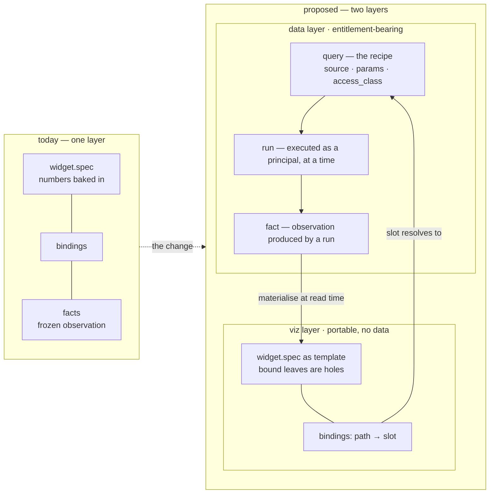
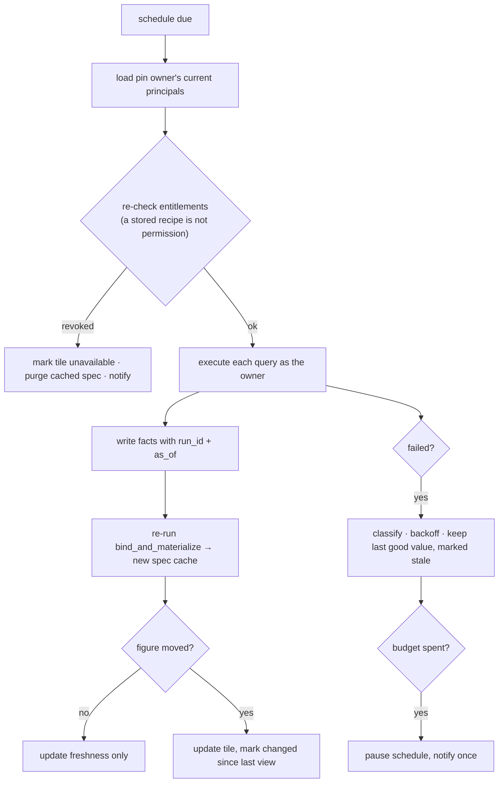
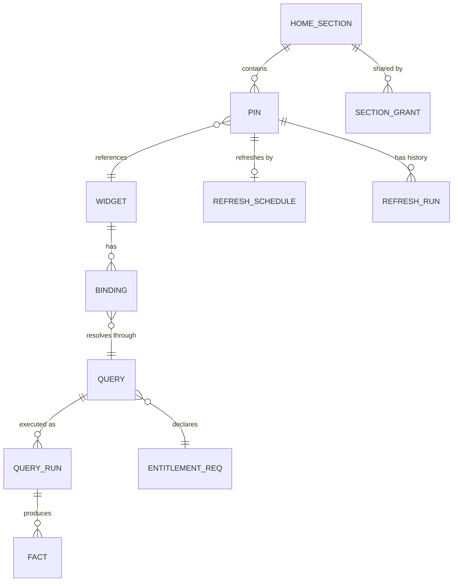
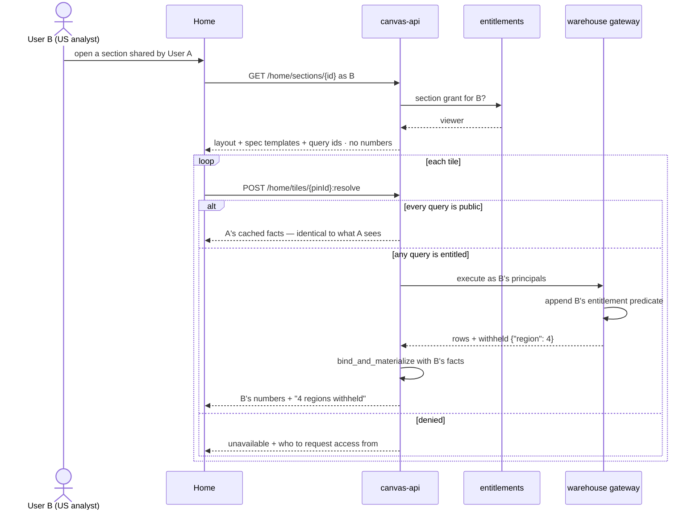

# Home screen — design proposal

Status: **proposal, not built.** Diagrams and decisions for review.

A canvas answers one question and is done. Home is the opposite surface: the small
set of answers you want standing when you arrive, kept current without asking. The
composer sits at the top so Home is also where the next question starts.

Read `canvas-technical-architecture.md` §3.7 and §10 first — Home pins, sections and
refresh schedules were specified there. This document is the concrete version, and it
changes one thing the plan assumed we already had: **a widget today is not
re-executable.** §2 is that problem; everything else follows from it.

---

## 1. The surface

```
┌────┬────────────────────────────────────────────────────────────┐
│    │  Monday, 10 August                                          │
│ ▣  │  Good morning, Aman                                         │
│ ◈  │                                                             │
│ ⌸  │   ── Morning brief ────────────────────── assembled 06:40   │
│ ⚑  │   ┌──────────────────────────────────────────────────────┐ │
│ ⌗  │   │ ✦ EMEA gross margin fell 240bp on the quarter close   │ │
│ ⟳  │   │   38.1% → 35.7% · 4 of 5 regions steady   [look] [×]  │ │
│ ⇄  │   └──────────────────────────────────────────────────────┘ │
│ ⊙  │   ┌────────┐ ┌────────┐ ┌──────────────────┐               │
│    │   │  KPI   │ │  KPI   │ │      chart       │               │
│    │   └────────┘ └────────┘ └──────────────────┘               │
│    │   ── Revenue ─────────────────────────── 2 tiles updated    │
│    │   ┌──────────────────┐ ┌────────┐                          │
│    │   │      chart       │ │ table  │                          │
│    │   └──────────────────┘ └────────┘                          │
│    │                                                             │
│    │   ◷ Brief   ↗ Revenue   ◑ Margin   ⬗ Cash                   │
│    │   ⇉ Plan   ◍ Market   ▤ Filings                             │
└────┴────────────────────────────────────────────────────────────┘
      left rail = places                    dock = sections
```

The rail's second item is the **Inbox** (`✉ 2`), and it is a different kind of thing
from everything on this screen — see §1.2.

Three things are load-bearing:

1. **The dock and the section list are the same taxonomy.** In the reference
   screenshot the dock is a set of product modules and the sections are something
   else. Here they are one list, which means "which section?" in the pin modal has an
   obvious answer set, and a dock icon is just "scroll to that band".
2. **There is no composer on Home.** No prompt box, no Generate, no suggested-prompt
   chips. Asking happens on a canvas, which is what a canvas is for. Home is the
   surface you *read* — standing answers that keep themselves current, plus whatever
   the ambient agent found while you were away. See `ambient-agent-design.md`; the two
   documents are halves of one idea, because a Home with a prompt box is just a slower
   way to start a canvas, whereas a Home with no input has to earn its place by
   telling you something you did not ask for.
3. **Sections are the sharing unit**, not individual tiles (§6). You share "my Revenue
   band", the way you'd share a folder.

The **Morning brief** section is the one band the user does not curate: it is assembled
each morning from findings that cleared the interrupt budget, and it is empty on a quiet
day. Every other section is pins.

### 1.1 Proposed icons

**Left rail — places you go.** Each maps to something that already exists in the code.

| Icon | Place | Backed by |
|---|---|---|
| ▣ | **Home** | this document |
| ✉ | **Inbox** | `home.findings` where `interaction` is question or review — §1.2 |
| ◈ | **Canvases** | `canvas.canvases`, the existing nav sheet |
| ⌸ | **Documents** | `documents.files`, `DocumentContext.tsx` |
| ⚑ | **Sources** | connectors + *what am I entitled to* — the screen where user B learns they are US-only |
| ⌗ | **Facts** | `canvas.facts` — the provenance ledger, every number and where it came from |
| ⟳ | **Schedules** | refresh runs, last success, failures, paused schedules |
| ⇄ | **Shared** | `canvas.grants` — shared with me / by me, with per-tile access state |
| ⊙ | **Activity** | `audit.events` |

**Dock — sections of Home.** Eight, matching the reference's eight.

| Icon | Section | What lands here | Usual access class |
|---|---|---|---|
| ◷ | **Morning brief** | what moved overnight; the default landing band | mixed |
| ↗ | **Revenue** | bookings, ARR, revenue by region and segment | entitled |
| ◑ | **Margin & cost** | gross margin, opex, unit economics | entitled |
| ⬗ | **Cash** | runway, burn, collections, DSO | entitled |
| ⇉ | **Plan vs actual** | budget variance, forecast drift | entitled |
| ◍ | **Market** | peers, rates, commodities — built from live web search | **public** |
| ▤ | **Filings & docs** | tiles built off uploaded PDFs | entitled |

Market being a *whole section* that is normally public is deliberate: it makes the
sharing rule in §6 visible as a property of where a tile lives, rather than a hidden
per-tile flag.

An earlier draft had an eighth dock section called **Signals**, holding agent-authored
findings. It is gone, because it was two incompatible things wearing one name — §1.2.

### 1.2 The glance and the queue

Home and the Inbox are both agent surfaces and they are **not the same surface**. The
distinction is whether the item is *about* something or *addressed to* you.

| | **Home** — the glance | **Inbox** — the queue |
|---|---|---|
| Holds | tiles, and notify findings about them | questions the agent could not resolve; proposals awaiting review |
| Asks of you | nothing | a decision |
| Bounded by | the interrupt budget — always readable in ten seconds | nothing; it is a queue |
| Correct empty state | normal, most days | **zero** — the goal |
| Actions | look, dismiss | accept · edit · respond · ignore |
| Lives in | the dock | the rail, with a count |

The draft I am correcting had findings that missed the brief's budget fall through to
a Signals list. That breaks the queue: an inbox where most items need no response is a
feed, and people stop triaging feeds within about a week. Then the one item that
genuinely needed an answer is sitting behind forty that did not.

**So a notify finding that misses the brief does not go in a list at all — it goes on
its tile.** It was always *about* that tile, and the tile is where you would look. The
tile carries a changed-since-you-last-looked marker and the finding reads on expand.
Nothing is lost, nothing is queued, and the Inbox stays answerable.

Which leaves the Inbox holding only the two interaction types that are genuinely
addressed to a person, and makes inbox-zero an achievable state rather than a slogan.
It is also why it belongs in the rail rather than the dock: every dock item is a band
of tiles on Home, and this one is a place you go to answer things.

---

## 2. The problem: a widget cannot be re-run

This is the reason the feature is more than a pin table.

Today a widget is materialised at write time. `commands.py:bind_and_materialize`
resolves each binding's fact value into the spec, then — if the widget claims
`measured` — refuses to store it unless every numeric leaf is covered by a binding:

```python
if (provenance or {}).get("confidence") == "measured":
    for leaf in _numeric_leaves(kind, spec):
        if not _covered(leaf, bound):
            return None, f'"{...}" is labelled measured but is not bound to a fact — …'
```

That is a good invariant and it stays. But note what the stored row then contains:

```
canvas.widgets.spec      → numbers, baked in
canvas.widgets.bindings  → path → factId
canvas.facts             → value + tool + query + sourceUrl + asOf, frozen
```

A fact is an **observation**, not a recipe. It records that `web_search` returned
`455.0` on a Tuesday. Nothing in the row can produce Wednesday's number, and nothing
can produce *a different viewer's* number. So a pinned tile can be re-rendered but not
refreshed, and cannot be re-evaluated for a second person — which is precisely what
§5 and §6 need.

There is a second, sharper version of the same problem. `canvas.grants` shares a whole
canvas by role, and `get_canvas_state` returns materialised specs. Today every fact
comes from public web search, so a grantee seeing the numbers is correct. **The moment
a warehouse connector lands (§7), sharing a canvas hands the grantee entitled figures
baked into a JSON blob, with no viewer-side check anywhere in the path.** Home makes
this urgent rather than creating it.

### 2.1 The split



Concretely:

- **New: `canvas.queries`** — a typed, re-executable recipe. `source`, `params`,
  `access_class`, a fingerprint. This is the thing a refresh runs.
- **Changed: `canvas.facts`** gains `query_id` and `run_id`. A fact becomes the output
  of a run rather than an orphan. Existing facts keep `query_id = NULL`, which is
  honest: they are one-off observations and a tile built only from them is
  **snapshot-only, not refreshable**. The UI says so rather than pretending.
- **Changed in kind, not in shape: `widget.spec`.** The stored spec stays exactly as
  it is, but is demoted to a *cache of the last materialisation*. Truth for any bound
  leaf is `binding → query → latest run → fact`. Unbound leaves are unchanged and
  still governed by the `measured` invariant above.

The seam already exists: `bind_and_materialize` is the only function that writes a
fact value into a spec. Making it callable at read time, against a fact set chosen per
viewer, is the whole mechanism. Nothing about the ECharts adapter, the widget kinds,
or `chartAdapter.ts` changes.

### 2.2 Access class

Every query carries one, derived from its source — never chosen by the user or the
model:

| `access_class` | Sources | Shareable as | Refresh runs as |
|---|---|---|---|
| `public` | `web_search`, `x_search` | **snapshot** — recipient sees your numbers | anyone |
| `entitled` | `warehouse`, `document` | **live only** — recipient's render re-executes as them | pin owner, or viewer |
| `derived` | `code_execution` | max() of its input queries | inherits |

`derived` taking the strictest class of its inputs is the rule that keeps
`code_execution` from being a laundering step: a ratio of two warehouse figures is
warehouse-class, even though the arithmetic happened locally.

---

## 3. Pinning

```mermaid
sequenceDiagram
    actor U as User
    participant C as Canvas
    participant M as Pin modal
    participant API as canvas-api
    participant Q as query layer

    U->>C: ⋯ menu on a widget → Pin to Home
    C->>API: GET /home/pin-preview?widgetId=…
    API->>Q: walk bindings → queries
    Q-->>API: per-query access_class, refreshability, suggested cadence
    API-->>M: sections, cadences, computed share mode, warnings
    Note over M: "2 of 3 numbers are re-runnable.<br/>1 is a frozen web observation."
    U->>M: choose section + cadence
    M->>API: POST /home/pins
    API->>API: authorise, create pin + schedule, audit
    API-->>C: pinned; tile appears in that section
```

The modal is the only new UI of consequence. It asks three questions and *reports* two
answers.

**Asks:**

- **Section** — the eight from §1.1, defaulted from the widget's dominant query source
  (warehouse revenue query → Revenue; web-only → Market).
- **Refresh cadence** — §4. *When to look.* For a warehouse-backed tile the modal
  offers **on source update** as the default (D-4): it is the only cadence that cannot
  be wrong, since it fires because the data moved rather than because a clock did.
  Web-only tiles keep manual as the default — there is no watermark to watch.
- **Watch condition** *(optional)* — *when to speak.* A band on one bound figure:
  "tell me if gross margin goes below 36%", "if this moves more than 5% in a week".
  Cadence and watch are deliberately separate settings: polling frequency and
  interrupt threshold are different decisions, and collapsing them is why most
  alerting is either noisy or late. A watch condition is the user-set entry point to
  the ambient agent — see `ambient-agent-design.md` §3.

**Reports, does not ask:**

- **Refreshability.** Per bound number: re-runnable, or frozen. A tile with any frozen
  binding cannot honour a cadence for that figure, and the modal says which figure.
  Offering a daily refresh on a number that physically cannot move is the kind of lie
  that makes people stop trusting the dashboard.
- **Share mode** — computed from §2.2, shown as a sentence: *"Shares live. Recipients
  see their own regions."* or *"Shares as a snapshot — these are public figures."*

---

## 4. Refresh cadences

Three families. Default is **Manual** — a pin with no schedule is the common case and
scheduling everything is how you get a thundering herd against the warehouse at 09:00.

**Clock**

| Option | Notes |
|---|---|
| Manual only | default |
| Every 15 minutes | market-hours tiles only; quota'd |
| Hourly | |
| Daily, 07:00 local | |
| Weekly, Monday 07:00 | |
| Custom | cron, admin-gated |

**Fiscal calendar** — resolved against the org's fiscal calendar, not the Gregorian one.

| Option | Fires |
|---|---|
| Month close | +1 business day after fiscal month end |
| Quarter close | +1 business day after fiscal quarter end |
| Fiscal year end | |

**Event** — the finance-specific ones you asked for.

| Option | Fires | Event source |
|---|---|---|
| Market open / close | per exchange, per trading calendar | exchange calendar |
| Before earnings | T-2 trading days from the report date | `finance.earnings_calendar` |
| After earnings | first market open following the report | `finance.earnings_calendar` |
| On new filing | 10-Q / 10-K / 8-K appears | `finance.filings` |
| On source update | the table's load watermark advances | `finance.load_watermark` |

**These need an event source, and that is the honest constraint on the group.** A
cadence is only as good as the calendar behind it. The mock warehouse in §7 carries
`earnings_calendar`, `filings` and `load_watermark` so all five are demonstrable
end-to-end; in production each is a connector, and a cadence whose source is missing is
offered greyed-out with the reason rather than silently never firing.

"On source update" is the one I would push hardest. It is the only cadence that fires
because the *data* changed rather than because a clock did, so it is both cheaper and
more correct than hourly polling — and the watermark is trivial to expose.

### 4.1 What a refresh actually does



Two rules worth stating explicitly, both from the architecture doc and both easy to
get wrong:

- A failed refresh **keeps the last good value and marks it stale.** It does not blank
  the tile. A CFO glancing at Home needs "this is Tuesday's number" far more than an
  empty card.
- A refresh **re-checks entitlements every time.** The stored recipe is not standing
  permission to execute it.

---

## 5. Storage



```sql
CREATE SCHEMA IF NOT EXISTS home;

-- Sections are user data, not an enum. The seven in §1.1 are seeded on first login
-- and are renameable, reorderable and deletable from there (D-1). `brief` is the one
-- key the assembler looks up, so it is reserved rather than special-cased elsewhere.
CREATE TABLE home.sections (
  id UUID PRIMARY KEY DEFAULT gen_random_uuid(),
  owner_subject TEXT NOT NULL,
  key   TEXT NOT NULL,            -- 'brief' is reserved; the rest are seeds, not a closed set
  title TEXT NOT NULL,
  ord   INT  NOT NULL,
  UNIQUE (owner_subject, key)
);

-- When the ambient worker assembles this person's brief (D-6).
CREATE TABLE home.prefs (
  owner_subject TEXT PRIMARY KEY,
  brief_hour INT NOT NULL DEFAULT 7,          -- local hour, 0–23
  timezone   TEXT NOT NULL DEFAULT 'UTC'
);

CREATE TABLE home.pins (
  id UUID PRIMARY KEY DEFAULT gen_random_uuid(),
  owner_subject TEXT NOT NULL,
  section_id UUID NOT NULL REFERENCES home.sections(id) ON DELETE CASCADE,
  widget_id  UUID NOT NULL REFERENCES canvas.widgets(id) ON DELETE CASCADE,
  ord INT NOT NULL,
  w INT NOT NULL, h INT NOT NULL,
  -- last materialisation, per §2.1 a cache and never the source of truth
  cached_spec JSONB,
  cached_at   TIMESTAMPTZ,
  status TEXT NOT NULL DEFAULT 'ok',      -- ok | stale | unavailable
  status_reason TEXT,
  created_at TIMESTAMPTZ NOT NULL DEFAULT now()
);
CREATE INDEX idx_pins_owner ON home.pins (owner_subject, section_id, ord);

CREATE TABLE home.schedules (
  pin_id UUID PRIMARY KEY REFERENCES home.pins(id) ON DELETE CASCADE,
  family TEXT NOT NULL,                    -- clock | fiscal | event
  kind   TEXT NOT NULL,                    -- daily_0700 | quarter_close | after_earnings | …
  params JSONB,                            -- exchange, ticker, cron, timezone
  enabled BOOLEAN NOT NULL DEFAULT true,
  next_run_at TIMESTAMPTZ,
  attempts INT NOT NULL DEFAULT 0,
  last_ok_at TIMESTAMPTZ,
  last_error TEXT
);
CREATE INDEX idx_schedules_due ON home.schedules (next_run_at) WHERE enabled;

-- section-level sharing (§6). Delegated, never a copy of data.
CREATE TABLE home.section_grants (
  section_id UUID NOT NULL REFERENCES home.sections(id) ON DELETE CASCADE,
  principal  TEXT NOT NULL,                -- 'user:<sub>' | 'group:<id>'
  granted_by TEXT NOT NULL,
  granted_at TIMESTAMPTZ NOT NULL DEFAULT now(),
  PRIMARY KEY (section_id, principal)
);
```

And the data layer, in `canvas.*` beside the facts it produces:

```sql
CREATE TABLE canvas.queries (
  id UUID PRIMARY KEY DEFAULT gen_random_uuid(),
  canvas_id UUID REFERENCES canvas.canvases(id) ON DELETE CASCADE,
  source TEXT NOT NULL,                    -- web | warehouse | document | compute
  access_class TEXT NOT NULL,              -- public | entitled | derived
  op     TEXT NOT NULL,                    -- named, registered operation — never SQL
  params JSONB NOT NULL,
  input_query_ids UUID[],                  -- compute only; access_class = max(inputs)
  fingerprint TEXT NOT NULL,               -- sha256(source|op|params) — dedupes recipes
  created_at TIMESTAMPTZ NOT NULL DEFAULT now(),
  UNIQUE (canvas_id, fingerprint)
);

CREATE TABLE canvas.query_runs (
  id UUID PRIMARY KEY DEFAULT gen_random_uuid(),
  query_id UUID NOT NULL REFERENCES canvas.queries(id) ON DELETE CASCADE,
  ran_as TEXT NOT NULL,                    -- principal the run executed under
  entitlement_fingerprint TEXT,            -- opaque; cache key input, never evidence
  status TEXT NOT NULL,                    -- ok | narrowed | denied | failed
  withheld JSONB,                          -- {"region": 4} — see §6
  ran_at TIMESTAMPTZ NOT NULL DEFAULT now()
);

ALTER TABLE canvas.facts ADD COLUMN query_id UUID REFERENCES canvas.queries(id);
ALTER TABLE canvas.facts ADD COLUMN run_id   UUID REFERENCES canvas.query_runs(id);
```

`op` is a registered operation name with typed params — never SQL, never a string the
model composed. Same rule as the existing tool layer.

---

## 6. Sharing and delegated access

**The share mode is derived, not chosen.** A user asked to classify their own tile
will get it wrong, and the failure is silent and one-directional.



The rules:

1. **A shared section transmits recipes, never numbers**, when any query is
   `entitled`. The response to user B does not contain user A's values at any point.
2. **Public-only tiles share as a snapshot.** A tile built from web search has no
   viewer-specific answer, so re-executing per viewer would just cost money and give a
   different result for no reason. This is your "not all tiles need delegation" case,
   and it falls out of §2.2 rather than being a special case.
3. **Narrowed is a first-class outcome, distinct from full.** If B is entitled to one
   of five regions, the tile shows B's number **and says four regions are withheld.**
   A total that is quietly smaller is the single most dangerous thing this system could
   render — B would read a company-wide revenue tile as company-wide. `withheld` on
   the run row exists for exactly this.
4. **Denied shows remediation**, not a blank tile: what is missing and who grants it.
5. **Revocation is immediate.** Grants are checked per resolve, and sessions are
   server-side rows (`auth.py`), so removing a group takes effect on B's next request.

### 6.1 Prerequisite, and it is not optional

Point 1 cannot be true while `get_canvas_state` returns materialised specs to anyone
holding a canvas grant. Before any warehouse-backed tile can be shared, the canvas read
path needs the same treatment: **return the spec template plus query ids, and resolve
values per viewer.** With web-only facts the current behaviour is correct; with §7 it
is a data leak. I would sequence this *before* section sharing, not alongside it.

---

## 7. The mock warehouse

A local stand-in for the internal finance sources, in the same Postgres, so
`access_class = entitled` has something real behind it and the two-user story is
demonstrable end to end.

Company: **Northwind Analytics**, a fictional B2B software company. FY26. Five regions,
three segments, 24 months of history. Figures are invented and labelled as such — the
seed marks every fact `confidence = 'illustrative'` so nothing from the mock can be
mistaken for a measured figure elsewhere in the canvas.

```sql
CREATE SCHEMA finance;

CREATE TABLE finance.regions  (code TEXT PRIMARY KEY, name TEXT, parent TEXT);
--   NA-US, NA-CA, EMEA-UK, EMEA-DE, APAC-JP
CREATE TABLE finance.segments (code TEXT PRIMARY KEY, name TEXT);
--   PLATFORM, SERVICES, HARDWARE

CREATE TABLE finance.revenue_monthly (
  month DATE, region_code TEXT REFERENCES finance.regions(code),
  segment_code TEXT REFERENCES finance.segments(code),
  bookings NUMERIC, revenue NUMERIC, cogs NUMERIC, opex NUMERIC, churn_pct NUMERIC,
  PRIMARY KEY (month, region_code, segment_code)
);

CREATE TABLE finance.headcount_monthly (
  month DATE, region_code TEXT, function TEXT, headcount INT, cost NUMERIC,
  PRIMARY KEY (month, region_code, function)
);

CREATE TABLE finance.earnings_calendar (period TEXT PRIMARY KEY, report_date DATE, status TEXT);
CREATE TABLE finance.filings (id SERIAL PRIMARY KEY, kind TEXT, period TEXT, filed_at TIMESTAMPTZ);
CREATE TABLE finance.load_watermark (table_name TEXT PRIMARY KEY, loaded_at TIMESTAMPTZ);

-- row-level entitlement, by dimension so it generalises past region
CREATE TABLE finance.entitlements (
  principal TEXT NOT NULL,        -- 'user:<sub>' | 'group:<id>' — same shape as canvas.grants
  dimension TEXT NOT NULL,        -- 'region' | 'segment'
  value     TEXT NOT NULL,        -- a code, or '*'
  PRIMARY KEY (principal, dimension, value)
);
```

Seeded principals:

| | Principal | Groups | Entitlement | Sees |
|---|---|---|---|---|
| **User A** | `user:ada@northwind.example` | `finance-leadership` | `('group:finance-leadership','region','*')` | all 5 regions, all segments |
| **User B** | `user:blake@northwind.example` | `us-analysts` | `('group:us-analysts','region','NA-US')` | US only |

The gateway is one function and every warehouse query goes through it:

```python
async def execute(op: str, params: dict, principals: Sequence[str]) -> QueryResult:
    """Runs a registered op with the caller's entitlement predicate appended.

    The predicate is built here from finance.entitlements, never from params —
    a caller-supplied region filter can only ever narrow what the predicate allows.
    Returns rows, a `withheld` count per restricted dimension, and an opaque
    entitlement fingerprint for the cache key.
    """
```

Three properties that make this a real test rather than a demo:

- **The predicate is appended, never substituted.** A caller asking for `EMEA-DE`
  while entitled to `NA-US` gets an empty result and `withheld: {"region": 1}` — not
  an error that tells them EMEA-DE exists, and not EMEA-DE's numbers.
- **`withheld` is computed against the full dimension**, so the API can always say
  "4 of 5 regions withheld" without disclosing which.
- **The entitlement fingerprint is part of the query cache key**, so A's cached rows
  can never be served to B. This is the specific bug this design exists to prevent.

The demo it enables: A pins *Revenue by region* to Revenue with cadence **quarter
close**, and shares the section with B. A sees five bars and $480M. B opens the same
tile, the recipe re-executes as B, and B sees one bar, the US number, and *"4 regions
withheld — request access from Ada."* Same pin, same recipe, no shared numbers.

---

## 8. HTTP surface

```text
GET    /api/home                                  # sections + pins + cached tiles, as caller
POST   /api/home/pins                             # { widgetId, sectionKey, schedule? }
PATCH  /api/home/pins/{pinId}                     # section, order, size
DELETE /api/home/pins/{pinId}
GET    /api/home/pin-preview?widgetId=            # modal payload: refreshability, share mode, warnings
POST   /api/home/pins/{pinId}:refresh             # manual refresh, runs as caller
PUT    /api/home/pins/{pinId}/schedule
DELETE /api/home/pins/{pinId}/schedule
POST   /api/home/tiles/{pinId}:resolve            # per-viewer materialisation (§6)
GET    /api/home/sections/{sectionId}             # a shared section, as viewer
POST   /api/home/sections/{sectionId}/grants
DELETE /api/home/sections/{sectionId}/grants/{principal}
GET    /api/sources                               # connectors + what the caller is entitled to
```

---

## 9. Build order

Each step is useful shipped alone, and each is a prerequisite for the next.

1. **Data layer split** — `canvas.queries`, `canvas.query_runs`, `query_id`/`run_id`
   on facts. `bind_and_materialize` becomes callable at read time. No visible change.
2. **Mock warehouse** — `finance.*`, the gateway, the two seeded users, a
   `warehouse_query` tool beside `web_search`. Ask a question, get entitled numbers.
3. **Home, personal** — sections, pins, the modal, manual refresh. No sharing.
4. **Schedules** — clock and fiscal families on the existing `SKIP LOCKED` worker
   pattern; event family once its sources are wired.
5. **Per-viewer canvas resolve** — §6.1. The prerequisite for anything shared.
6. **Section sharing** — grants, narrowed and denied states, the withheld disclosure.

---

## 10. Decisions

Settled 10 August 2026. Numbered so the rest of the document and
`ambient-agent-design.md` can cite them.

| | Decision | Consequence |
|---|---|---|
| **D-0** | **The dock and the section list are one taxonomy.** Resolved by construction, not by argument: the Inbox was the only dock item that was not a band of tiles, and §1.2 moved it to the rail. Every dock item is now a section and every section is a band. | §1.1 |
| **D-1** | **Sections are seeded, not fixed.** The seven finance names ship as defaults on first login and are renameable, reorderable and deletable. Section keys are user data; only `brief` is reserved. | §5 — `home.sections` is per-owner rows, never an enum or a CHECK constraint |
| **D-2** | **Sharing is section-level.** One grant per section per principal. Tile-level stays an escape hatch to add if someone asks for it, not a v1 surface. | §5 `home.section_grants`, §6 |
| **D-3** | **A pin follows its widget.** The pin references the artifact and edits flow through; `duplicate` is the explicit gesture for a frozen copy. Confirms `canvas-technical-architecture.md`'s existing decision now that refresh exists. | undo already covers destructive edits; no version-tracking UI needed |
| **D-4** | **Warehouse-backed tiles default to "on source update".** Web-only tiles default to manual, since there is no watermark to watch. | §3, §4 |

Two of these are worth watching in use rather than treating as closed. **D-1** makes
auto-filing a pinned tile harder for the agent — with a fixed enum it could pick a
section confidently; with user-renamed sections it has to match against strings, so
the pin modal's suggested section will be wrong more often. **D-3** means a
destructive canvas edit propagates to Home silently; the mitigation is undo, and if
that turns out to be too thin, version-pinning with an "update available" prompt is
the fallback.
